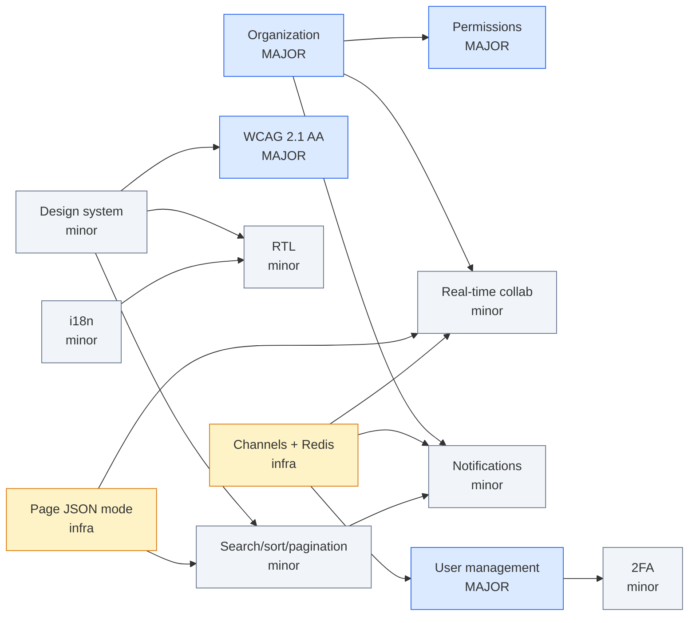

# PlanShift — Module Audit & Implementation Plan (target: 18 points)

> Audit date: 2026-09-10 · Based on the code at commit `6581213` · Team: 3 developers
>
> Subject rule that drives every verdict below (Chapter IV, p. 11):
> *"Only fully functional and properly implemented modules will be counted. Non-functional or
> incomplete modules = 0 points."*

---

## 1. TL;DR

| # | Module | Type | Pts | Your estimate | Actual state | % done | Can it be claimed today? |
|---|---|---|---|---|---|---|---|
| 1 | Framework frontend + backend (React 19 + Django 6) | Major | 2 | Done | Done | **100%** | ✅ Yes |
| 2 | ORM (Django ORM) | Minor | 1 | Done | Done | **100%** | ✅ Yes |
| 3 | Advanced search, filters, sorting, pagination | Minor | 1 | Done | Filters only | **~30%** | ❌ No |
| 4 | Notification system for all C/U/D actions | Minor | 1 | Partial | Actor-only flash toasts | **~30%** | ❌ No |
| 5 | Real-time collaborative features | Minor | 1 | Partial | Nothing real-time exists | **0%** | ❌ No |
| 6 | Custom design system (≥10 components) | Minor | 1 | Partial | Tokens + some components | **~55%** | ❌ No (risky) |
| 7 | Organization system | Major | 2 | Partial | Shifts scoped per manager only | **~10%** | ❌ No |
| 8 | Advanced permissions system | Major | 2 | Partial | 2 hard-coded roles | **~40%** | ❌ No |
| 9 | WCAG 2.1 AA accessibility | Major | 2 | New | Some ARIA groundwork | **~20%** | ❌ No |
| 10 | Standard user management | Major | 2 | New | Initials avatar only | **~5%** | ❌ No |
| 11 | 2FA | Minor | 1 | New | — | **0%** | ❌ No |
| 12 | i18n (≥3 languages) | Minor | 1 | New | `USE_I18N=True` only | **~5%** | ❌ No |
| 13 | RTL support | Minor | 1 | New | — | **0%** | ❌ No |
| | **Total if all finished** | | **18** | | | | **Secure today: 3** |

**Your point arithmetic is right:** 2+1+1 (claimed done) + 1+1+1+2+2 (partial) = 11, + 2+2+1 = 16,
+ 1+1 = **18**.

**Two corrections to the premise:**

1. **Search/filter/sort/pagination is not done.** The shift calendar has three server-side filters,
   but there is no text search, no user-controlled sorting and no pagination anywhere. Points
   secured today are **3**, not 4.
2. **Real-time collaboration: the interaction exists, the real-time part is 0%.** Employee
   unavailability blocking the manager's assignment is a real manager↔employee interaction on
   shared data, and it's the right use case for this module. But nothing propagates live: the
   stack is synchronous WSGI (`backend/config/settings.py:60`) with no WebSockets, SSE or
   polling. The manager's calendar doesn't even show unavailability. The manager only finds out
   from the "Employee is unavailable" error when saving. Manager↔employee live updates can be
   built without the Organization module; manager↔manager collaboration needs it.

**Security issue found during the audit (fix it with the Organization module):** sign-up is
public and creates a *manager*, but employees and positions are global. `_get_employee_or_404`
(`backend/apps/accounts/views.py`) and the position views
(`backend/apps/scheduling/views.py`) don't filter by owner. Anyone who signs up
can list, edit, reset the password of, or delete **every employee in the database**. The README's
"Known limitations" mentions the shared directory, but with public sign-up it's a cross-tenant
authorization hole, and an evaluator can find it in two clicks.

---

## 2. Module-by-module audit

### 2.1 Major: Framework for frontend and backend — ✅ 100%

- React 19 renders every page (`frontend/src/pages/**`, one `src/main.jsx` entry that picks the page from the payload).
- Django 6 handles routing, auth, forms, ORM, CSRF and sessions (`backend/apps/**`).
- Nothing missing. At evaluation, be ready to explain the state-injection pattern
  (`render_app()` in `backend/apps/frontend/shell.py`). Don't also claim the two *Minor* framework
  modules, because they overlap with this Major.

### 2.2 Minor: ORM — ✅ 100%

- Five models with deliberate `on_delete` choices, `UniqueConstraint`s, migrations, annotated
  queries (`Count`, `F`) in `services.py`. All data access goes through the ORM.

### 2.3 Minor: Advanced search, filters, sorting, pagination — ⚠️ ~30%

| Sub-feature | State | Evidence |
|---|---|---|
| Filters | ✅ Partly | Position multi-select, status, understaffed: `ShiftsToolbar.jsx`, `services.shifts_for_manager` |
| Search (text query) | ❌ | No `q` parameter anywhere |
| Sorting (user-controlled) | ❌ | Only fixed `Meta.ordering`. Team table headers aren't sortable |
| Pagination | ❌ | Team table loads every employee (`User.objects.filter(role=EMPLOYEE)`) |
| Week/month navigation | ⚠️ Not pagination | The server loads only the visible period, but it's calendar navigation, not a result list split into pages |

A calendar can't be meaningfully paginated or sorted: it's always ordered by time. So the module
needs a **list/table surface**. The cheapest one is a "List" view of shifts: it reuses the existing
server-side filters in `shifts_for_manager` and only adds a search box, sortable column headers
and a `Paginator`, about 1.5–2 pd.

### 2.4 Minor: Notification system for all C/U/D actions — ⚠️ ~30%

- ✅ Every write view calls `messages.add_message` and the message shows as a toast
  (`Toasts.jsx`, `_redirect_with_message` helpers).
- ❌ The toast only reaches **the actor**. Nobody else is notified: when a shift is published the
  assigned employee finds out only by opening the calendar, and managers never learn about new
  unavailability.
- ❌ No persistence: no `Notification` model, no history, no unread count, no bell, no mark-as-read.
- ❌ Not every action is covered: the unavailability toggle (fetch) shows a toast only on error.

A "notification **system**" for "**all**" actions will be judged on persisted, per-recipient
notifications. Toasts count as the UI layer only.

### 2.5 Minor: Real-time collaborative features — ❌ 0%

- WSGI only (`WSGI_APPLICATION`), `requirements.txt` contains only Django, no Redis, and nginx has
  no `Upgrade` handling.
- Every write is a full-page POST→redirect. Pages read their data once from the bootstrap payload
  and never refresh.
- What exists: a shared rule between two roles. Employee unavailability blocks assignment
  (`services._check_availability`), and published shifts appear on the employee calendar. That's
  asynchronous multi-user consistency, enforced at save time, not real-time collaboration.
- The manager UI never receives unavailability data (not in `manager_shifts` payload), so the
  manager learns about it only from the save error.
- The first real-time use case needs no Organization module: live unavailability markers on the
  manager calendar, and live publish/assignment updates on the employee calendar.
  Manager↔manager live editing and presence need Organization.

### 2.6 Minor: Custom design system (≥10 reusable components) — ⚠️ ~55%

| Present | Missing |
|---|---|
| Tokens: palette, radii, shadows, one font family (`styles/tokens.css`) | Typography **scale** tokens (sizes/weights/line-heights) |
| 8 SVG icons (`Icons.jsx`) | A real icon set (bell, user, search, sort, globe, lock, upload…) |
| React components: `Modal`, `ConfirmModal`, `Dropdown`, `SelectPopover`, `Field`, `ToastProvider`, `CalendarNav`, `MonthCalendar`, `AppShell`, `Footer`, `PostForm` | `Button`, `Badge`, `Avatar`, `Card`, `Table` exist only as **CSS class strings** repeated in JSX (`className="btn btn-primary"`), not as components |
| | A showcase/documentation page to demo at evaluation |

You can reach 10 by count, but `PostForm`, `AppShell` and `Footer` are plumbing and layout, not
design-system primitives. The first thing an evaluator asks is "show me your Button component",
and there isn't one yet.

### 2.7 Major: Organization system — ❌ ~10%

| Requirement | State |
|---|---|
| Create / edit / delete organizations | ❌ No model |
| Add users to organizations | ❌ (managers create employees, but into a global pool) |
| Remove users from organizations | ❌ |
| View orgs + create/read/update inside an org | ❌. Shifts are scoped by `created_by`, positions and employees are global |

### 2.8 Major: Advanced permissions system — ⚠️ ~40%

| Requirement | State |
|---|---|
| View, edit, delete users (CRUD) | ⚠️ Managers can CRUD **employees only**, not managers or other users |
| Roles management (admin, user, guest, moderator…) | ❌ Two hard-coded roles (`UserRole` in `accounts/models.py`). No UI to assign or change roles |
| Different views and actions per role | ✅ `manager_required` / `employee_required`, separate nav and pages |

### 2.9 Major: WCAG 2.1 AA — ⚠️ ~20%

Groundwork exists: `Field` wires `aria-invalid`/`aria-describedby`, toasts use `aria-live`,
`Modal` has `role="dialog" aria-modal`, and there's a shared Escape stack. Concrete failures found:

| Issue | Where | WCAG SC |
|---|---|---|
| Modal has no initial focus, focus trap or focus return | `components/Modal.jsx` (no focus code at all) | 2.4.3, 2.1.2 |
| Clickable `
`s are mouse-only: day cells (**the employee's unavailability toggle**) and week-grid slots | `Calendar.jsx`, `ShiftGrids.jsx` (WeekGrid) | 2.1.1 |
| `role="button"` span with no `tabIndex`/key handler | `ShiftFormModal.jsx:29` | 2.1.1, 4.1.2 |
| `role="menu"` without arrow-key navigation or focus management | `Menus.jsx:88` | 4.1.2 |
| Destructive button: white on `hsl(0 84% 60%)` ≈ **3.8:1** (needs 4.5:1) | `tokens.css` | 1.4.3 |
| Position chip colours come from `hue = id*47 % 360`, so text contrast varies per hue | `app/shifts.js` (`positionPalette`) | 1.4.3 |
| Draft vs. published and positions are told apart mainly by colour | calendar CSS | 1.4.1 |
| Toasts auto-dismiss after 3 s (errors after 5 s) with no pause | `Toasts.jsx:7-8` | 2.2.1 |
| No skip link, and headings/landmarks are inconsistent | all pages | 2.4.1, 1.3.1 |
| `lang="en"` is hard-coded | `templates/app.html` | 3.1.1 (ties into i18n) |

### 2.10 Major: Standard user management — ❌ ~5%

| Requirement | State |
|---|---|
| Update own profile info | ❌ No profile or settings page; users can't change their own name, email or password |
| Avatar upload + default avatar | ⚠️ Only the default exists (an initials circle). No upload, no `MEDIA_*`, no Pillow |
| Friends + online status | ❌ |
| Profile page | ❌ |

### 2.11 Minor: 2FA — ❌ 0%

Nothing exists. Note: the demo-login buttons bypass passwords, so they need handling for 2FA to
count as "complete". (The Django admin was removed on 2026-09-10, so it is no longer a bypass.)

### 2.12 Minor: i18n (≥3 languages) — ❌ ~5%

- `USE_I18N=True` is Django's default. There's no `LocaleMiddleware`, no `.po` files and no client
  i18n.
- All strings are hard-coded in JSX, in Django flash messages, in `legal/documents.py` (271 lines)
  and in date labels: `WEEKDAY_LABELS` in `app/dates.js:1`, and server-side `strftime("%B %Y")`
  period labels in `scheduling/views.py`.

### 2.13 Minor: RTL — ❌ 0%

- No `dir` attribute. There are 17 physical-direction usages (`left/right`, `ml-/mr-/pl-/pr-`) in
  `frontend/src`, the toasts are pinned `right-4`, and the chevron icons don't flip.
- One piece of good news: `WeekGrid` places cells with explicit CSS `gridColumn` indices, and CSS
  Grid mirrors those automatically under `direction: rtl`.

---

## 3. What the new modules change in the architecture

Four structural changes make the rest possible. Doing them first, and once, avoids refactoring
twice.

| # | Change | Why | Modules it unlocks |
|---|---|---|---|
| A | **Organization becomes the tenant boundary.** New `Organization` + `Membership(user, org, role, position)`. `User.role` and `User.position` move onto `Membership`. `Position` and `Shift` gain an `organization` FK. Middleware sets `request.organization` / `request.membership` | Every query, permission check, notification recipient list and WebSocket group is "per organization" | Organization, Permissions, Real-time collab, Notifications, User mgmt (friends/profile visibility), Search scoping |
| B | **Permission matrix in one module** (`apps/accounts/permissions.py`): role → capabilities, a `@require_perm("shift.edit")` decorator, and `permissions: [...]` sent in the bootstrap payload so React hides what the user can't do | Replaces the two booleans `is_manager`/`is_employee` | Permissions, Organization, "different views per role" |
| C | **JSON mode for every page view.** `render_app()` returns `JsonResponse(data)` when `Accept: application/json`, and the frontend gets a `usePageData()` hook (`[data, refresh]`) instead of reading `getBootstrap().data` once | Lets pages refresh without a full reload. You don't need a REST API; each view stays the single source of its payload | Search (debounced queries), Real-time (refetch on event), Notifications (bell refresh), RTL/i18n seamless switching |
| D | **ASGI + Django Channels + Redis.** `daphne` in `INSTALLED_APPS`, `ProtocolTypeRouter` in `asgi.py`, a `redis:7-alpine` service in compose, and a `location /ws/` block in nginx with `Upgrade`/`Connection` headers. Groups `org_<id>` and `user_<id>`. Events are broadcast from `transaction.on_commit` in `services.py` | The only honest way to do "real-time" and "online status" | Real-time collab, Notification push, Online status (user mgmt) |

**Cross-cutting conventions to adopt on day 1.** New UI built after this point is then already
accessible, translatable and RTL-safe, and the final WCAG/i18n/RTL passes shrink to audits:

1. No raw user-facing strings in JSX. Everything goes through `t('key')`.
2. No physical direction. Use `ms-/me-/ps-/pe-/start-/end-/text-start` (Tailwind v4 logical
   utilities) and `margin-inline-*` in CSS. Enforce it with a grep check in CI.
3. Every interactive element is a `<button>`/`<a>`/`<input>` (never a clickable `div`), with a
   visible `:focus-visible` ring.
4. New UI is built only from design-system components.

**New dependencies** (the README currently says "one line: Django", so update it):
`channels`, `daphne`, `channels-redis`, `pyotp`, `segno` (QR as SVG), `Pillow`. Frontend:
`i18next` + `react-i18next`. Dev-only: `@axe-core/playwright` + `playwright`.

---

## 4. Dependency graph

(2FA only depends on the profile/settings page for its enable/disable screen, and can start
earlier if someone is free.)

---

## 5. Step-by-step implementation plan

Roles for the 3-person team:

- **A: Backend lead.** Data model, permissions, Channels, security (2FA).
- **B: Frontend / design.** Design system, accessibility, RTL, live UI.
- **C: Full-stack features.** i18n, search, notifications, user management.

Estimates are in **person-days (pd)** for someone who knows this codebase.

---

### Phase 0: Foundations (days 1–3)

#### Step 0.1: Finish the design system · Minor · **B** · 3 pd

**Changes**
- `styles/tokens.css`: add a type scale (`--text-xs … --text-3xl`, weights, line-heights), a
  focus-ring token, and **fix contrast** (darken `--color-destructive` to ≈ `hsl(0 72% 45%)`,
  audit `warning`/`info`).
- New `frontend/src/components/ui/`: `Button` (primary/outline/ghost/destructive, sizes,
  `loading`), `IconButton`, `Badge`, `Avatar` (image → initials fallback → online dot), `Card`,
  `Spinner`, `ProgressBar`, `EmptyState`, `Switch`/`Checkbox`, `Tabs`, `Alert`.
- `Icons.jsx`: grow to ~20 icons (bell, user, users, search, sort-asc/desc, globe, lock, shield,
  upload, check, building, settings, logout…). Add a `flipInRtl` flag on directional icons.
- `Modal.jsx`: add initial focus, focus trap and focus return. This lays the first WCAG brick.
- Showcase page `/design-system/` (new entry `design-system.jsx`, one `render_app` view) that shows
  every component and variant. This is what you open at evaluation.
- Replace `className="btn …"` strings in existing pages with the components.

**Done when:** ≥10 documented primitives, the showcase page renders, and no page uses raw `btn`
classes.

#### Step 0.2: i18n infrastructure · (part of Minor i18n) · **C** · 1.5 pd

**Changes**
- Backend: `LocaleMiddleware`, `LANGUAGES = [en, ar, <third>]`, `LOCALE_PATHS`,
  `User.language` field and migration. `render_app` adds `locale` and `dir` to the bootstrap;
  `app.html` renders `<html lang="{{ locale }}" dir="{{ dir }}">`.
- Frontend: `src/app/i18n.js` (i18next initialized from the bootstrap locale), JSON catalogs in
  `src/locales/{en,ar,xx}.json`, a `LanguageSwitcher` in the header that changes language
  client-side instantly and persists it with a POST to `/settings/language/`.
- Dates: replace `WEEKDAY_LABELS` and the server `strftime` period labels with `Intl.DateTimeFormat`
  on the client.
- CI grep: fail on new physical-direction classes.

**Done when:** switching language flips `lang`/`dir` without a reload, and the header and login
page are translated.

#### Step 0.3: Page JSON mode (infra C) · **A** · 1 pd

**Changes**
- `render_app()`: when `Accept: application/json`, return `JsonResponse({"data": data,
  "messages": …})`.
- `src/app/usePageData.js`: `const [data, refresh] = usePageData()`. Migrate
  `ManagerShiftsPage`, `EmployeeShiftsPage` and `ManagerEmployeesPage` to it.

---

### Phase 1: Tenant boundary (days 3–8)

#### Step 1.1: Organization system · Major · **A** (backend) + **B** (UI) · 4 pd

**Models & migrations** (`apps/organizations/`)
- `Organization(name, slug, created_by, created_at)`.
- `Membership(user, organization, role, position FK→Position null, joined_at)`, unique
  `(user, organization)`.
- `Position.organization` FK, with `unique(name)` → `unique(organization, name)`.
- `Shift.organization` FK.
- **Data migration**: create "Default organization", attach every existing position and shift,
  and turn each `User.role`/`User.position` into a `Membership`. Then drop the two `User` columns.

**Backend changes**
- `OrganizationMiddleware`: reads `session["org_id"]`, verifies membership, sets
  `request.organization` and `request.membership`. If the user has no membership, redirect to
  "create or join an organization".
- Re-scope **every** query: `shifts_for_manager` filters by `organization` instead of
  `created_by` (managers in the same org now share the schedule, which real-time collab needs),
  and `_get_employee_or_404`, position views and `services.save_shift` employee lookups filter
  through `Membership`. `_check_position_match` reads `Membership.position`.
- Sign-up creates User + Organization + `Membership(role=ADMIN)` in one transaction.
- Views: org create / edit / delete (owner only, with confirmation; cascades), members list,
  add member (existing user by email, or create account as today), remove member (deletes
  membership and their future assignments in that org).
- **Tests:** cross-org isolation. A manager of org A gets 404 for org B's shifts, employees,
  positions and members. This closes the security hole from §1.

**Frontend changes (B)**
- Org switcher in the header (a `Dropdown`), "Organization settings" page (edit/delete), "Members"
  page (table with role + position, add/remove).

**Evaluation demo:** create org → invite user → user sees org → create/read/update shifts inside
it → remove user → user loses access.

#### Step 1.2: Advanced permissions · Major · **A** · 3 pd (overlaps 1.1)

**Roles** (on `Membership.role`):

| Role | Can |
|---|---|
| **Admin** (org owner) | Everything, plus edit/delete org, change roles, CRUD all members |
| **Manager** | Shifts, positions, employee members. Can't change roles or delete the org |
| **Employee** | Own published shifts, own unavailability, profile, friends |
| **Guest** | Read-only published schedule of the org (auditor, new hire before onboarding) |

**Changes**
- `apps/accounts/permissions.py`: `ROLE_CAPABILITIES = {ADMIN: {...}, MANAGER: {...}, …}`,
  `can(membership, "shift.edit")`, `@require_perm(...)`. Replace
  `manager_required`/`employee_required` everywhere.
- Bootstrap adds `permissions: [...capabilities]`. The UI hides buttons, nav items and pages.
  The server stays the authority.
- **Roles management UI:** on the Members page, admins get a role `<select>` per member and a
  "Roles & permissions" panel showing the capability matrix read-only.
- **Users CRUD:** admins view/edit/delete *any* member (managers included). Deleting the last
  admin is blocked.
- **Different views:** a guest sees the calendar with no edit affordances or drafts. An employee
  sees their own calendar. Managers and admins see the editor and extra nav.
- Tests: a matrix test that, for every role × every protected URL, asserts allowed → 200/302 and
  denied → 403/404.

#### Step 1.3: Search, filters, sorting, pagination · Minor · **C** · 2.5 pd

**Changes**
- Backend helper `apps/core/listing.py`: `list_query(request, qs, search_fields=…,
  filters={…}, sort_whitelist={…}, page_size=20)`. It uses Django `Paginator` and returns
  `{items, page, pages, total, sort, filters, q}`. Only whitelisted sort keys are accepted, so
  there's no ORM injection.
- **Members/Team page:** `q` over name / email / employee ID, filter by position / role / active,
  sortable column headers (`aria-sort`), paginated.
- **New "List" view for shifts** next to Week/Month in `ShiftsToolbar`: a table with the existing
  filters plus a date range, sortable by date / position / staffing / status, paginated. It
  doubles as the **accessible alternative** to the calendar grid for WCAG.
- Design-system additions (with B): `DataTable`, `SortHeader`, `Pagination`, `SearchInput`
  (debounced, refetches via JSON mode, URL kept in sync with `history.replaceState`).

**Done when:** a search, a filter, a sort and a page change all combine, and survive reload and
back/forward.

---

### Phase 2: Real-time backbone (days 8–12)

#### Step 2.1: Channels infrastructure (infra D) · **A** · 2 pd

> ✅ **Mostly done with Step 2.3.0 (2026-09-10).** Channels + Daphne, the Redis service,
> nginx `/ws/`, `ScheduleConsumer`, `notify_managers()` and the `useLiveEvents()` hook are in
> place. Still to do: presence tracking and the `user_<id>` group.

**Changes**
- `requirements.txt`: `channels`, `daphne`, `channels-redis`. `docker-compose.yml`: a `redis`
  service on the internal network. `settings.py`: `ASGI_APPLICATION`, `CHANNEL_LAYERS`.
- `config/asgi.py`: `ProtocolTypeRouter` with `AllowedHostsOriginValidator(AuthMiddlewareStack(…))`.
- `apps/realtime/consumers.py`: one `AppConsumer` that joins `user_<id>` and `org_<id>` and
  tracks presence in Redis (a per-user connection counter with TTL heartbeat).
- `apps/realtime/broadcast.py`: `broadcast_org(org, event, payload)`, called from
  `transaction.on_commit` in `services.py` and the other write views.
- `docker/nginx/nginx.conf.template`: `location /ws/ { proxy_http_version 1.1; proxy_set_header
  Upgrade $http_upgrade; proxy_set_header Connection "upgrade"; proxy_read_timeout 1h; }`.
- Frontend `src/app/live.js`: a `useLiveSocket()` singleton with exponential-backoff reconnect and
  a "Reconnecting…" banner.

> 💡 This step already meets most of **Major: Real-time features using WebSockets** (real-time
> updates across clients, graceful connect/disconnect, group broadcasting). Claim it as a
> **+2 safety margin** (see §7).

#### Step 2.2: Notification system · Minor · **C** · 3.5 pd

**Model** `apps/notifications/models.py`:
`Notification(recipient, actor null, organization, verb, target_type, target_id null,
target_label, params JSON, created_at, read_at null)`, indexed on `(recipient, read_at)`.
Store a **key + params**, not rendered text, so each notification renders in the *reader's*
language. Store `target_label` as a snapshot, because deletion events outlive their target.

**Service** `notify(recipients, verb, *, actor, target, **params)` → bulk-create, then push to each
`user_<id>` group on commit.

**Coverage matrix** (this is what "all creation, update, and deletion actions" means):

| Action | Recipients |
|---|---|
| Shift created / updated / deleted | Other managers/admins of the org; assigned employees if published |
| Shift published (single / bulk) | Assigned employees |
| Assignment added / removed | That employee |
| Employee/member created / updated / deleted / role changed | The member (where they still exist) + org admins |
| Position created / updated / deleted | Org managers/admins |
| Unavailability set / cleared | Org managers |
| Organization updated / deleted, member added / removed | Affected members |
| Friend request sent / accepted / removed | The other user |
| Profile / avatar / 2FA changed | The user (security notice) |

**UI**
- Bell in `AppShell` with an unread badge (count in bootstrap, live via WS) and a dropdown of the
  latest 10 with "Mark all read".
- `/notifications/` page built on the `DataTable`/`Pagination` from Step 1.3 (filter
  read/unread/type, sort by date).
- A live notification also raises a toast. The actor's own flash toast stays as it is today.

**Tests:** one test per row of the matrix asserting recipients and count.

#### Step 2.3: Real-time collaborative features · Minor · **B** (frontend) + **A** (backend) · 3.5 pd

**Starting point: the collaboration logic exists, but it isn't real-time yet.** An employee
marking a day unavailable really does stop the manager from assigning them
(`services._check_availability`, run inside the save transaction). That's the right foundation
for this module. But "real-time" means a change shows up on the *other person's already-open
screen* without a reload, and today nothing is pushed anywhere.

What the code did before Step 2.3.0 (commit `6581213`):

- The manager's employee list in `ShiftFormModal` is filtered **only by position**
  (`positionEmployees`, `ShiftFormModal.jsx:63-66`).
- The payload behind it (`_build_employee_payload` in `scheduling/views.py`) has no
  unavailability data and is built once per page load, not per date. Changing the date in the
  modal doesn't change the list.
- An unavailable employee can still be ticked. The server then rejects the save with *"Employee
  is unavailable on YYYY-MM-DD."*, shown as a toast.

To verify in 1 minute: as the employee, mark tomorrow unavailable. As the manager, create a shift
for tomorrow with that employee's position, tick them, and save.

Two-browser test the evaluator will run: the employee marks a day unavailable, and the manager's
**open** calendar must update without F5.

**Step 2.3.0 — ✅ done (2026-09-10):** employee availability now reaches managers live.

- The manager page payload carries `unavailability` per employee
  (`_build_unavailability_payload`).
- The employee toggle broadcasts `unavailability.changed` to a global `managers` group after commit
  (`apps/realtime/events.py`). It becomes `org_<id>` once Organization lands.
- In the open manager calendar, with no reload:
  - The shift form greys out and labels unavailable employees for the selected date, excludes them
    from "Select all", flags already-picked ones, and blocks submit.
  - The sidebar lists each employee's unavailable days in the visible period, and the changed row
    flashes.
  - A toast names who changed what.
  - A Live / Reconnecting indicator shows the connection state.
- Not done yet: unavailable markers inside the week/month grid cells themselves (sidebar only).

Then, once Organization lands, the "shared workspace" is the organization's schedule. Deliver all
three of these so the module can't be argued away:

1. **Live updates.** When anyone in the org creates, edits, publishes or deletes a shift, or an
   employee toggles unavailability, every open calendar (manager week/month/list, employee month)
   refreshes its data through `usePageData().refresh()` without a reload, and open modals keep
   their state.
2. **Presence.** Avatars of who else is viewing the schedule, and which week: "Anna and Tom are
   here". Each client sends its current `view/date` over the socket.
3. **Live editing awareness + conflict safety.** Opening `ShiftFormModal` broadcasts "Anna is
   editing this shift" (a badge on the chip for others). Saving sends `updated_at` as a version.
   If it changed meanwhile, the server rejects the save and the modal offers "Reload changes /
   Overwrite".

**Changes:** `Shift` version check in `services.save_shift`; `WeekShiftChip`/`MonthShiftChip` (`ShiftGrids.jsx`) "being edited"
indicator; `PresenceBar` component; employee calendar subscribes too.

**Evaluation demo:** two browsers, two managers of the same org, side by side.

---

### Phase 3: User features (days 12–16)

#### Step 3.1: Standard user management · Major · **C** · 5 pd

| Sub-feature | Changes |
|---|---|
| **Profile page** `/users/<id>/` | Name, avatar, role and position in the current org, online/last-seen, friend button. Visible to members of a shared org, otherwise 404 |
| **Update profile** `/settings/profile/` | Edit name/email (re-validate uniqueness), change password (Django `PasswordChangeForm` + `update_session_auth_hash`), language preference. This is also where the 2FA section lives |
| **Avatar upload** | `User.avatar = ImageField(upload_to="avatars/", null=True)`, `Pillow`, `MEDIA_ROOT` on a new `media_data` volume served by nginx `location /media/avatars/`. Validation on both sides: type (JPEG/PNG/WebP by *content*, not extension), ≤2 MB, max dimensions. **Re-encode to 256×256 WebP** (strips EXIF and polyglot payloads). Random filenames. Progress bar via `XMLHttpRequest.upload.onprogress` (`ProgressBar` from the DS). "Remove avatar" falls back to the initials **default** |
| **Default avatar** | The existing initials circle becomes the `Avatar` fallback, used everywhere (header, Team table, sidebar, notifications, presence) |
| **Friends** | `Friendship(from_user, to_user, status: pending/accepted, created_at)` with a unique unordered pair. Send / accept / decline / remove; a "Friends" page with incoming/outgoing requests. Framed in the UI as "Colleagues" if you like, but keep the word *friends* visible for the evaluator |
| **Online status** | From Channels presence (Step 2.1): a green dot on `Avatar`, plus `User.last_seen` updated on socket disconnect → "last seen 5 min ago" |

**Tests:** avatar validation (wrong MIME with image extension, oversize, non-image), friendship
state machine, profile visibility across orgs.

#### Step 3.2: 2FA · Minor · **A** · 2.5 pd

**Models:** `TOTPDevice(user OneToOne, secret, confirmed_at, last_used_step)`,
`RecoveryCode(user, code_hash, used_at)`.

**Flows**
1. **Enroll** (Settings → Security): generate secret → show QR (`segno` SVG) and manual key →
   the user enters a code → confirm → show **10 recovery codes once** (reuse the
   `CredentialsModal` pattern), stored hashed.
2. **Login:** after a correct password, *don't* call `login()`. Store `pending_2fa_user_id` + a
   timestamp in the session and redirect to `/login/verify/`. Accept a TOTP (±1 step, reject
   `step <= last_used_step` to block replay) or a recovery code. 5 attempts, 5-minute expiry.
3. **Disable / regenerate codes:** requires the password + a current code.
4. **Admin reset:** an org admin can reset a member's 2FA (permission `member.reset_2fa`),
   which notifies the user.
5. **Close bypasses:** make demo login refuse accounts that have 2FA enabled (the Django admin
   no longer exists).

**Tests:** full login with TOTP, a replayed code, a recovery code used once, lockout after 5,
admin bypass closed.

#### Step 3.3: WCAG 2.1 AA remediation · Major · **B** · 6 pd (the riskiest module)

**Changes**
- **Keyboard:** day cells and week slots become `<button>`s, or a `role="grid"` with roving
  `tabindex` and arrow/Home/End/PageUp/PageDown. Enter creates or opens. `Menus` gets the
  APG menu pattern (arrow keys, Escape returns focus). Remove every `role="button"` span.
- **Screen readers:** each shift chip gets an accessible name ("Barista, Mon 14 Sep, 09:00–13:00,
  2 of 3 staffed, draft"). Live-region announcements for real-time changes and notifications
  (polite) and errors (assertive). A visually hidden `h1` per page, consistent
  `header/nav/main/footer` landmarks, a skip link.
- **Alternative view:** the shift **List** view (Step 1.3) is the fully accessible equivalent of
  the calendar grid, linked from the grid ("View as list").
- **Colour:** contrast pass on every token and state (≥4.5:1 text, ≥3:1 UI and focus ring).
  Position chips pick black or white text by computed luminance. Draft/published and
  unavailable also get a text/icon/pattern, not colour alone.
- **Timing/motion:** toasts pause on hover/focus, errors persist until dismissed, and
  `prefers-reduced-motion` is respected.
- **Forms:** every input has a label, errors are linked (already done in `Field`), autocomplete
  attributes on auth forms.
- **Zoom/reflow:** usable at 200% zoom and 320 px width. The calendar collapses to the list view.
- **Tooling:** `@axe-core/playwright` tests over every page × role (0 violations) run in CI, plus
  a written manual test script for VoiceOver (macOS) and NVDA (Windows), and an
  **Accessibility statement** page linked in the footer.

---

### Phase 4: Cross-cutting completion (days 16–21)

#### Step 4.1: i18n completion · Minor · **C** (+ **B**) · 3.5 pd + translation time

- **String extraction sweep:** every JSX string → `t()`. Server strings (flash messages, form
  errors, notification templates, e-mail/legal) → `gettext`/`gettext_lazy`, then
  `makemessages`/`compilemessages` (run in the Dockerfile build stage). Django already ships
  translations of its own validation messages for many languages, including Arabic.
- **Legal documents** (`legal/documents.py`, 271 lines) must be translated too, because "all
  user-facing text must be translatable". This is the biggest translation chunk.
- **Languages:** English + **Arabic** (also covers RTL) + one language a team member speaks
  natively. Have a human who can read Arabic review the Arabic translation; machine-only output
  risks rejection.
- Plurals via i18next/`ngettext` ("1 shift / 3 shifts" in Arabic needs its 6 plural forms).
  Numbers and dates via `Intl`.
- A CI check fails when a key is missing in any catalog.

#### Step 4.2: RTL support · Minor · **B** · 2.5 pd

- Replace the remaining physical CSS with logical properties (`inset-inline-end`,
  `margin-inline-start`, `text-align: start`, `border-inline-*`).
- `dir="rtl"` on `<html>` from the locale. The `rtl:` variant covers exceptions: flip directional
  icons (chevrons, arrows), **swap the meaning of prev/next** in `CalendarNav`, toasts move to
  `end`, dropdowns align to `end`, the time axis moves to the right.
- Verify the grid mirroring in `WeekGrid` and `MonthCalendar` (explicit `gridColumn` mirrors
  automatically, so check that sticky offsets and scrollbars follow). Check `Modal` close-button
  placement, form layouts, table column order, and the `DataTable` sort icon.
- **Seamless switching:** the language switcher changes `i18n` + `document.dir` in place, with no
  reload, and the page payload is re-fetched via JSON mode to pick up server-localized labels.
- Screenshots of every page in AR for the README.

#### Step 4.3: Hardening, docs, rehearsal · **A** + everyone · 2–3 pd

- README: fill the **Modules** table (justification, implementation, owner for each), the new
  schema diagram (Organization, Membership, Notification, Friendship, TOTPDevice), new
  dependencies, the Accessibility statement, supported languages.
- Regression pass of all tests, and a security review of the new endpoints (IDOR across orgs,
  upload handling, WS origin check, 2FA bypasses).
- **Evaluation rehearsal:** each member demos and explains the modules they own. The subject
  requires every member to be able to explain their work.

---

## 6. Timeline (3 people, ~21 working days ≈ 4–5 weeks)

| Days | A: Backend lead | B: Frontend/design | C: Full-stack |
|---|---|---|---|
| 1–3 | 0.3 JSON mode · start Org models + data migration | **0.1 Design system** | **0.2 i18n infra** |
| 3–8 | **1.1 Organization** + **1.2 Permissions** (backend, tests) | 1.1/1.2 UI: org switcher, settings, members, roles | **1.3 Search/sort/pagination** + DataTable (with B) |
| 8–12 | **2.1 Channels/Redis/nginx** · 2.3 backend (version check, presence) | **2.3 Real-time collab** UI | **2.2 Notifications** |
| 12–16 | **3.2 2FA** | **3.3 WCAG** remediation | **3.1 User management** |
| 16–21 | 4.3 hardening, axe CI, security review, README | **4.2 RTL** · finish WCAG | **4.1 i18n** extraction + translations |
| 21–22 | Rehearsal (all) | Rehearsal (all) | Rehearsal (all) |

Effort total ≈ **45 person-days**, which is ~15 days each plus ~25% integration/review buffer.

| Module | Pts | Effort (pd) | Owner |
|---|---|---|---|
| Design system | 1 | 3 | B |
| Search / filter / sort / pagination | 1 | 2.5 | C |
| Organization | 2 | 4 | A + B |
| Permissions | 2 | 3 | A |
| Channels infra | (bonus 2) | 2 | A |
| Notifications | 1 | 3.5 | C |
| Real-time collab | 1 | 3.5 | B + A |
| User management | 2 | 5 | C |
| 2FA | 1 | 2.5 | A |
| WCAG 2.1 AA | 2 | 6 | B |
| i18n | 1 | 5 (+ translation) | C |
| RTL | 1 | 2.5 | B |

---

## 7. Risk and point margin

| Module | Rejection risk | Why | Mitigation |
|---|---|---|---|
| WCAG 2.1 AA (2) | **High** | "Complete compliance". A calendar grid is the hardest widget to make accessible | List view as the equivalent alternative, axe at 0 violations in CI, a scripted screen-reader demo |
| i18n (1) | Medium | "*All* user-facing text": one hard-coded toast or an English legal page fails it | Missing-key CI check, translated legal docs, gettext on server messages |
| Notifications (1) | Medium | "*All* C/U/D actions" | Coverage matrix with a test per row (§5 Step 2.2) |
| Real-time collab (1) | Medium | The evaluator may expect "live editing" specifically | Deliver live updates, presence and editing awareness together |
| Design system (1) | Low–Medium | The evaluator counts components | Showcase page with ≥15 documented primitives |
| Organization / Permissions (4) | Low | Clear requirements | Permission-matrix tests |

18 points gives only a 4-point margin over 14, and the WCAG module alone is 2 of it. Two cheap
additions reuse work you'll already have done:

- **Major: Real-time features using WebSockets (+2).** It comes almost free after Step 2.1: its
  three bullets (updates across clients, graceful disconnect, efficient broadcasting) are exactly
  what Step 2.1 builds. It costs ~0.5 pd of polish and docs.
- **Major: Allow users to interact with other users (+2).** The profile and friends parts come
  from Step 3.1. Only a **basic chat** is missing (org or DM channels over the same Channels
  consumer, messages persisted), ≈ 3 pd.

With both: **22 points** claimed, and 14 still reached even if WCAG and two Minors were rejected.

---

## 8. Draft README "Modules" table (fill in as each module lands)

| Module | Category | Type | Pts | Owner |
|---|---|---|---|---|
| Framework frontend + backend (React + Django) | Web | Major | 2 | all |
| ORM (Django ORM) | Web | Minor | 1 | A |
| Advanced search, filters, sorting, pagination | Web | Minor | 1 | C |
| Notification system (all C/U/D) | Web | Minor | 1 | C |
| Real-time collaborative features | Web | Minor | 1 | B + A |
| Custom design system | Web | Minor | 1 | B |
| Organization system | User Mgmt | Major | 2 | A + B |
| Advanced permissions system | User Mgmt | Major | 2 | A |
| Standard user management | User Mgmt | Major | 2 | C |
| 2FA | User Mgmt | Minor | 1 | A |
| WCAG 2.1 AA | Accessibility | Major | 2 | B |
| Multiple languages (EN/AR/+1) | Accessibility | Minor | 1 | C |
| RTL support | Accessibility | Minor | 1 | B |
| **Total** | | | **18** | |
| *Optional:* Real-time via WebSockets | Web | Major | +2 | A |
| *Optional:* User interaction (chat + profile + friends) | Web | Major | +2 | C |
