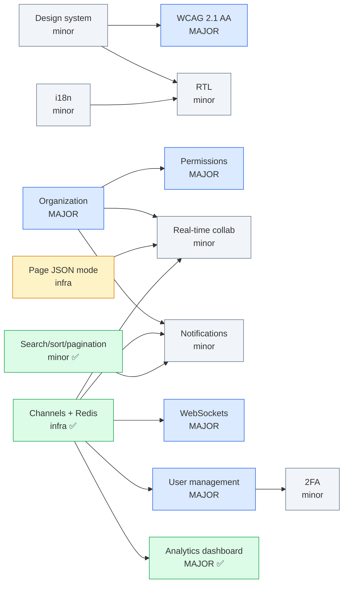

# PlanShift — Module Audit & Implementation Plan (target: 14 + margin)

> Re-audit date: 2026-09-13 · Based on the code at commit `791d3a7` · Team: 3 developers
> (previous audit: 2026-09-10 at `6581213`)
>
> Subject rule that drives every verdict below (Chapter IV, p. 11):
> *"Only fully functional and properly implemented modules will be counted. Non-functional or
> incomplete modules = 0 points."*
>
> Bonus rule (Chapter VII, p. 30): extra modules count only once the 14 mandatory points are
> validated, and the bonus is capped at **5 points**. So anything above 19 claimed points is pure
> safety margin, not extra score.

---

## 1. TL;DR

| # | Module | Type | Pts | 09-10 audit | Now (09-13) | % done | Can it be claimed today? |
|---|---|---|---|---|---|---|---|
| 1 | Framework frontend + backend (React 19 + Django 6) | Major | 2 | 100% | Done | **100%** | ✅ Yes |
| 2 | ORM (Django ORM) | Minor | 1 | 100% | Done | **100%** | ✅ Yes |
| 3 | Advanced search, filters, sorting, pagination | Minor | 1 | ~30% | Search page with `q`, 4 filters + dates, sort, pagination | **~85%** | ✅ Yes |
| 4 | Notification system for all C/U/D actions | Minor | 1 | ~30% | Bell + unread badge + history, but browser-local and actor-only | **~40%** | ❌ No |
| 5 | Real-time collaborative features | Minor | 1 | 0% | One live employee→manager flow | **~45%** | ⚠️ Arguable, risky |
| 6 | Custom design system (≥10 components) | Minor | 1 | ~55% | ≥10 by count, but no Button/Badge/Card, no type scale, no showcase | **~50%** | ❌ No |
| 7 | Organization system | Major | 2 | ~10% | Unchanged: shifts scoped per manager only | **~5%** | ❌ No |
| 8 | Advanced permissions system | Major | 2 | ~40% | Unchanged: 2 hard-coded roles | **~35%** | ❌ No |
| 9 | WCAG 2.1 AA accessibility | Major | 2 | ~20% | One fix, new hover-only widgets | **~15%** | ❌ No |
| 10 | Standard user management | Major | 2 | ~5% | Initials avatar only | **~5%** | ❌ No |
| 11 | 2FA | Minor | 1 | 0% | — (and the demo-login bypass is back) | **0%** | ❌ No |
| 12 | i18n (≥3 languages) | Minor | 1 | ~5% | Dates via `Intl` only | **~5%** | ❌ No |
| 13 | RTL support | Minor | 1 | 0% | Logical CSS adopted, no `dir` | **~15%** | ❌ No |
| 14 | **NEW** GDPR compliance features | Minor | 1 | — | Export, self-delete, confirmation emails, tests | **~95%** | ✅ Yes |
| 15 | **NEW** Advanced analytics dashboard | Major | 2 | — | Line/bar/donut charts, live refresh, CSV + PDF, date range + filters | **~90%** | ✅ Yes |
| 16 | *Optional* Real-time features using WebSockets | Major | 2 | (bonus idea) | Channels + Redis + reconnect, but managers-only | **~65%** | ⚠️ ~1 pd away |
| 17 | *Optional* Data export and import | Minor | 1 | — | CSV + JSON export, no import | **~35%** | ❌ No |
| | **Total if 1–15 finished** | | **21** | | | | **Secure today: 7** |

**Secure today: 7 points** (Framework 2 + ORM 1 + Search 1 + GDPR 1 + Analytics 2), up from 3.

**Shortest path to 14** (re-prioritized now that Analytics and GDPR are in):

| Step | Adds | Running total | Effort |
|---|---|---|---|
| Today | — | 7 | — |
| WebSockets Major: employee sockets + manager calendar refresh on `shifts.changed` | +2 | 9 | ~1 pd |
| Real-time collaborative (live shift updates everywhere + presence) | +1 | 10 | ~2–3 pd |
| Organization + Advanced permissions (also closes the security hole below) | +4 | **14** | ~7 pd |
| Then as margin/bonus (max +5): Notifications 1, Design system 1, 2FA 1, i18n 1, RTL 1 | +5 | 19 | ~15 pd |

WCAG (2 pts, ~6.5 pd, highest rejection risk) and Standard user management (2 pts, ~5 pd) are no
longer needed to reach 14. Keep them only if the team wants them; they are the most expensive
points on the list.

**Security issues (both still open):**

1. **Cross-tenant employee directory.** Sign-up is public and creates a *manager*
   (`SignUpForm`, `accounts/forms.py:61`), but employees and positions are global.
   `_get_employee_or_404` (`backend/apps/accounts/views.py:147`) and `position_delete`
   (`backend/apps/scheduling/views.py:222`) don't filter by owner. Anyone who signs up can list,
   edit, reset the password of, or delete **every employee in the database**. The new pages widen
   it: the Search and Analytics filter bars (`_filter_bar`, `scheduling/views.py:258`) and the
   manager calendar list every employee's name and unavailability to every manager. Fix it with
   the Organization module.
2. **Demo login is back** (commit `9fdb0f9`). `ENABLE_DEMO_LOGIN` defaults to `DEBUG`
   (`settings.py:128`) and `docker-compose.yml` defaults both to `1`. That's a password-less login
   anyone can use on the evaluated stack, and it becomes a 2FA bypass the moment 2FA exists.
   Default it to `0` in compose before evaluation.

---

## 2. Module-by-module audit

### 2.1 Major: Framework for frontend and backend — ✅ 100%

- React 19 renders every page (`frontend/src/pages/**`, one `src/main.jsx` entry that picks the page from the payload).
- Django 6 handles routing, auth, forms, ORM, CSRF and sessions (`backend/apps/**`).
- Nothing missing. At evaluation, be ready to explain the state-injection pattern
  (`render_app()` in `backend/apps/shell.py`). Don't also claim the two *Minor* framework
  modules, because they overlap with this Major.

### 2.2 Minor: ORM — ✅ 100%

- Five models with deliberate `on_delete` choices, `UniqueConstraint`s, migrations, annotated
  queries (`Count`, `F`, `Prefetch`) in `services.py`. All data access goes through the ORM.

### 2.3 Minor: Advanced search, filters, sorting, pagination — ✅ ~85%

| Sub-feature | State | Evidence |
|---|---|---|
| Search (text query) | ✅ | `q` matches position or assigned worker name (`services.shift_rows`, `services.py:145`) |
| Filters | ✅ | Position, worker, status, date range on the Search page; position/status/understaffed on the calendar |
| Sorting (user-controlled) | ✅ | Whitelisted keys `SEARCH_SORTS` (date/time/position/worker), asc/desc, `aria-sort` headers (`ManagerShiftSearchPage.jsx:48`) |
| Pagination | ✅ | Django `Paginator`, 25 per page (`manager_shift_search`, `scheduling/views.py:268`) |
| Combined + survives reload/back | ✅ | Everything lives in the query string (one GET form + `navigateWith`) |

**Remaining (~0.5 pd, optional):**
- Search and sort run in Python over every matching row, not in SQL. It works; be ready to explain
  why (search spans the worker names of a prefetched relation), or move it to `Q(...)` +
  `order_by` for scale.
- The Team table has no search, sort or pagination. Not required, but an evaluator may try it.

### 2.4 Minor: Notification system for all C/U/D actions — ⚠️ ~40%

- ✅ Every write view flashes a message that shows as a toast (`flash_redirect` in `shell.py`,
  `ToastProvider` in `components/Notifications.jsx`).
- ✅ New: a header bell with an unread badge, a history modal, mark-all-read on open and "Clear
  history" (`NotificationBell`). Repeats merge into a counter.
- ✅ New: managers get a live toast when an employee changes availability; GDPR export/deletion
  send confirmation emails.
- ❌ The history is **localStorage** (`planshift:notifications:<userId>`): per browser, not per
  recipient, and lost on another device.
- ❌ Other people still aren't notified. An employee isn't told when a shift is assigned,
  published or deleted; managers aren't told about position/employee changes.
- ❌ No `Notification` model, so nothing survives across devices or can be tested per recipient.

A "notification **system**" for "**all**" actions will be judged on persisted, per-recipient
notifications. What exists is a good UI layer for Step 2.2.

### 2.5 Minor: Real-time collaborative features — ⚠️ ~45%

- ✅ Infra: ASGI + Daphne, Channels, Redis channel layer, nginx `/ws/` with `Upgrade`,
  `AllowedHostsOriginValidator` + session auth (`config/asgi.py`), broadcasts from
  `transaction.on_commit` (`realtime/events.py`).
- ✅ Employee → manager live flow: toggling unavailability updates every open manager calendar
  without a reload (sidebar list + row flash + toast, and the shift form disables that employee
  for that date).
- ✅ Every shift write broadcasts `shifts.changed`; open Analytics dashboards re-fetch.
- ❌ The **manager calendar ignores `shifts.changed`**, so a second manager doesn't see new or
  edited shifts until F5.
- ❌ The **employee calendar has no socket**: `ScheduleConsumer` closes non-managers
  (`realtime/consumers.py:14`). A published shift doesn't appear live.
- ❌ No presence, no "who is editing", no conflict/version check.

One real cross-user live flow can be demoed, but "collaborative" is thin. See Step 2.3.

### 2.6 Minor: Custom design system (≥10 reusable components) — ⚠️ ~50%

| Present | Missing |
|---|---|
| Tokens: palette, radii, shadows, one font family (`styles/tokens.css`) | Typography **scale** tokens (sizes/weights/line-heights), focus-ring token |
| 9 SVG icons (`Icons.jsx`, `Download` and `ShieldCheck` added) | A real icon set (user, search, sort, globe, lock, upload…) |
| React components: `Modal`, `ConfirmModal`, `Dropdown`, `Field`, `SelectField`, `FilterSelect`, `DateRangeFields`, `ToastProvider`, `NotificationBell`, `CalendarNav`, `MonthCalendar`, `XYChart`, `DonutChart`, `EmptyChart` | `Button`, `Badge`, `Avatar`, `Card`, `Table` exist only as **CSS class strings** (`className="btn btn-primary"`), not as components |
| | A showcase/documentation page to demo at evaluation |

`SelectPopover` was removed by the simplify commit. You're over 10 by count, but the first
thing an evaluator asks is "show me your Button component", and there isn't one. Destructive red
still fails contrast (`tokens.css:21`).

### 2.7 Major: Organization system — ❌ ~5%

| Requirement | State |
|---|---|
| Create / edit / delete organizations | ❌ No model |
| Add users to organizations | ❌ (managers create employees, but into a global pool) |
| Remove users from organizations | ❌ |
| View orgs + create/read/update inside an org | ❌. Shifts are scoped by `created_by`, positions and employees are global |

### 2.8 Major: Advanced permissions system — ⚠️ ~35%

| Requirement | State |
|---|---|
| View, edit, delete users (CRUD) | ⚠️ Managers can CRUD **employees only**, not managers or other users |
| Roles management (admin, user, guest, moderator…) | ❌ Two hard-coded roles (`UserRole` in `accounts/models.py`). No UI to assign or change roles |
| Different views and actions per role | ✅ `manager_required` / `employee_required`, separate nav and pages |

### 2.9 Major: WCAG 2.1 AA — ⚠️ ~15%

Groundwork: `Field` wires `aria-invalid`/`aria-describedby`, toasts use `aria-live`, `Modal` has
`role="dialog" aria-modal`, a shared Escape stack, sort headers are real buttons with `aria-sort`,
charts have `role="img"` + `aria-label`. Fixed since 09-10: the `role="button"` span in
`ShiftFormModal` is gone (native checkboxes). Remaining failures:

| Issue | Where | WCAG SC |
|---|---|---|
| Modal has no initial focus, focus trap or focus return | `components/Modal.jsx` (no focus code at all) | 2.4.3, 2.1.2 |
| Clickable `
`s are mouse-only: day cells (**the employee's unavailability toggle**) | `Calendar.jsx:35` | 2.1.1 |
| Chart tooltips appear on mouse hover only | `Charts.jsx` (`onMouseEnter`) | 2.1.1, 1.4.13 |
| Export trigger says `aria-haspopup="menu"`, but the panel has no menu role or arrow keys | `ManagerAnalyticsPage.jsx:86`, `Menus.jsx` | 4.1.2 |
| Destructive button: white on `hsl(0 84% 60%)` ≈ **3.8:1** (needs 4.5:1) | `tokens.css:21` | 1.4.3 |
| Draft vs. published and positions are told apart mainly by colour | calendar CSS | 1.4.1 |
| Toasts auto-dismiss after 4 s (errors after 6 s) with no pause | `Notifications.jsx:83` | 2.2.1 |
| No skip link; no `:focus-visible` style beyond form inputs | all pages, `controls.css:104` | 2.4.1, 2.4.7 |
| `lang="en"` is hard-coded | `templates/app.html` | 3.1.1 (ties into i18n) |

### 2.10 Major: Standard user management — ❌ ~5%

| Requirement | State |
|---|---|
| Update own profile info | ❌ No profile or settings page; users can't change their own name, email or password |
| Avatar upload + default avatar | ⚠️ Only the default exists (an initials circle). No upload, no `MEDIA_*`, no Pillow |
| Friends + online status | ❌ |
| Profile page | ❌ (the new "Privacy & my data" page shows data but isn't a profile) |

### 2.11 Minor: 2FA — ❌ 0%

Nothing exists. Note the one-click demo login came back in `9fdb0f9`: it must be off (or also
require 2FA) when this module is demoed, otherwise it's a bypass.

### 2.12 Minor: i18n (≥3 languages) — ❌ ~5%

- `USE_I18N=True` is Django's default. There's no `LocaleMiddleware`, no `.po` files and no client
  i18n.
- All strings are hard-coded in JSX, in Django flash messages, in `legal/documents.py` (267 lines),
  in the privacy emails (`privacy/emails.py`) and in the analytics labels. Date labels already come
  from `Intl.DateTimeFormat` on the client.

### 2.13 Minor: RTL — ❌ ~15%

- New code uses logical utilities (`end-4`, `ms-auto`, `me-1.5`, `text-end`). The only physical
  left/right left in `frontend/src` is SVG chart geometry (`Charts.jsx`), which doesn't need to
  mirror.
- Still no `dir` attribute, no RTL language, and the chevron icons don't flip.
- The month grid is CSS Grid, which mirrors automatically under `direction: rtl`.

### 2.14 NEW — Minor: GDPR compliance features — ✅ ~95%

Added in `791d3a7` (`backend/apps/privacy/`, `frontend/src/pages/privacy/`), reachable from the
account menu ("Privacy & my data").

| Subject bullet | State | Evidence |
|---|---|---|
| Users can request their data | ✅ | `privacy_center` page |
| Data deletion with confirmation | ✅ | `delete_my_account`: retype email + password; managers who still own shifts are refused (`ProtectedError`) |
| Export user data in a readable format | ✅ | Indented JSON download (`export_my_data`) |
| Confirmation emails for data operations | ✅ | `privacy/emails.py`, also sent when a manager deletes an employee |

13 tests in `privacy/tests.py`. The only caveat: emails go to the console backend by default, so
at evaluation show them in `docker compose logs web`, or configure SMTP in `.env`.

### 2.15 NEW — Major: Advanced analytics dashboard with data visualization — ✅ ~90%

Added in `e555a45` (`manager_analytics*` views, `pages/manager-analytics/`).

| Subject bullet | State | Evidence |
|---|---|---|
| Interactive charts (line, bar, pie…) | ✅ | `XYChart` line + bar, `DonutChart`, hover tooltips, KPI cards, top lists (`Charts.jsx`) |
| Real-time data updates | ✅ | `shifts.changed` over WebSocket → re-fetch `manager_analytics_data` (`ManagerAnalyticsPage.jsx:62`), refresh on reconnect |
| Export (PDF, CSV…) | ✅ | CSV via `manager_analytics_export_csv`; PDF via a print stylesheet + `window.print()` |
| Customizable date ranges and filters | ✅ | Date range (default: last 30 days), position, worker, status |

**Remaining (~0.5 pd):** make chart values reachable by keyboard/screen reader (a visually hidden
data table per chart). Be ready to defend "PDF = browser print of a print layout". If the
evaluator wants a generated file, a server-side PDF is the fallback.

### 2.16 Optional — Major: Real-time features using WebSockets — ⚠️ ~65%

| Subject bullet | State |
|---|---|
| Real-time updates across clients | ⚠️ Yes, but only manager pages subscribe; the employee page has no socket |
| Handle connection/disconnection gracefully | ✅ Auth + origin check, capped exponential backoff reconnect, refetch on reconnect (`app/live.js`), broadcast failures logged, never fail the write |
| Efficient message broadcasting | ✅ Redis channel layer, group send after commit. ⚠️ One global `managers` group, no `user_<id>`/`org_<id>` groups |

About 1 pd to claim it: let employees connect (their own `user_<id>` group), push shift
publish/assign/delete to them, and make the manager calendar react to `shifts.changed`. That same
work also advances 2.5.

### 2.17 Optional — Minor: Data export and import — ❌ ~35%

Export exists in two formats (analytics CSV, GDPR JSON). There's no **import with validation**
and no bulk import. "Publish all" is a bulk operation, but not an import. A CSV import of
employees or shifts (validated with the existing forms, reported row by row) would finish it in
~1.5 pd.

### 2.18 Every other Chapter IV module

Everything not listed below is **0%** (no code at all): OAuth, Public API, SSR, PWA, File upload,
all Gaming, AI, Blockchain, Cybersecurity (WAF/Vault), ELK, Prometheus/Grafana, Microservices,
Game statistics, Advanced chat, User interaction (chat/profile/friends).

| Module | % | What exists |
|---|---|---|
| Minor: Frontend framework / Minor: Backend framework | 100% | Same code as the Major; can't be claimed on top of it |
| Minor: User activity analytics and insights dashboard | ~15% | The analytics page ranks workers by hours/shifts. That's workforce data, not app-usage activity, and it overlaps the Major above |
| Major: Public API | ~2% | Two session-authenticated JSON endpoints (`manager_analytics_data`, unavailability toggle). No API key, rate limit, docs, PUT/DELETE |
| Minor: Health check / status page / backups | ~2% | Only `restart: unless-stopped` in compose. No healthcheck, status page or backup |
| Minor: Support for additional browsers | ~2% | Standard web APIs only; nothing tested or documented in Firefox/Safari |

---

## 3. What the new modules change in the architecture

Four structural changes make the rest possible. Doing them first, and once, avoids refactoring
twice.

| # | Change | Why | Modules it unlocks | Status |
|---|---|---|---|---|
| A | **Organization becomes the tenant boundary.** New `Organization` + `Membership(user, org, role, position)`. `User.role` and `User.position` move onto `Membership`. `Position` and `Shift` gain an `organization` FK. Middleware sets `request.organization` / `request.membership` | Every query, permission check, notification recipient list and WebSocket group is "per organization" | Organization, Permissions, Real-time collab, Notifications, User mgmt, Search/Analytics scoping | ❌ |
| B | **Permission matrix in one module** (`apps/accounts/permissions.py`): role → capabilities, a `@require_perm("shift.edit")` decorator, and `permissions: [...]` sent in the bootstrap payload so React hides what the user can't do | Replaces the two booleans `is_manager`/`is_employee` | Permissions, Organization, "different views per role" | ❌ |
| C | **JSON mode for every page view.** `render_app()` returns `JsonResponse(data)` when `Accept: application/json`, and the frontend gets a `usePageData()` hook (`[data, refresh]`) instead of reading `getBootstrap().data` once | Lets pages refresh without a full reload | Real-time (refetch on event), Notifications (bell refresh), RTL/i18n seamless switching | ⚠️ Only Analytics has it (a dedicated `/data` endpoint) |
| D | **ASGI + Django Channels + Redis.** Groups `org_<id>` and `user_<id>`. Events broadcast from `transaction.on_commit` | The only honest way to do "real-time" and "online status" | Real-time collab, WebSockets Major, Notification push, Online status | ✅ Infra done; only a global `managers` group so far |

**Cross-cutting conventions to adopt now.** New UI built after this point is then already
accessible, translatable and RTL-safe, and the final WCAG/i18n/RTL passes shrink to audits:

1. No raw user-facing strings in JSX. Everything goes through `t('key')`.
2. No physical direction. Use `ms-/me-/ps-/pe-/start-/end-/text-start` (Tailwind v4 logical
   utilities) and `margin-inline-*` in CSS. ✅ New code already follows this; enforce it with a
   grep check in CI.
3. Every interactive element is a `<button>`/`<a>`/`<input>` (never a clickable `div`), with a
   visible `:focus-visible` ring.
4. New UI is built only from design-system components.

**Dependencies:** already added: `channels`, `daphne`, `channels-redis`. Still to add:
`pyotp`, `segno` (QR as SVG), `Pillow`. Frontend: `i18next` + `react-i18next`. Dev-only:
`@axe-core/playwright` + `playwright`.

---

## 4. Dependency graph

(2FA only depends on the profile/settings page for its enable/disable screen, and can start
earlier if someone is free.)

---

## 5. Step-by-step implementation plan

Roles for the 3-person team:

- **A: Backend lead.** Data model, permissions, Channels, security (2FA).
- **B: Frontend / design.** Design system, accessibility, RTL, live UI.
- **C: Full-stack features.** i18n, search, notifications, user management.

Estimates are in **person-days (pd)** for someone who knows this codebase.

---

### Phase 0: Foundations

#### Step 0.1: Finish the design system · Minor · **B** · 3 pd · ❌ not started

**Changes**
- `styles/tokens.css`: add a type scale (`--text-xs … --text-3xl`, weights, line-heights), a
  focus-ring token, and **fix contrast** (darken `--color-destructive` to ≈ `hsl(0 72% 45%)`,
  audit `warning`/`info`).
- New `frontend/src/components/ui/`: `Button` (primary/outline/ghost/destructive, sizes,
  `loading`), `IconButton`, `Badge`, `Avatar` (image → initials fallback → online dot), `Card`,
  `Spinner`, `ProgressBar`, `EmptyState`, `Switch`/`Checkbox`, `Tabs`, `Alert`. Promote the
  Search page's `SortHeader` and `Pagination` into shared `DataTable` parts.
- `Icons.jsx`: grow to ~20 icons (user, users, search, sort-asc/desc, globe, lock, upload, check,
  building, settings, logout…). Add a `flipInRtl` flag on directional icons.
- `Modal.jsx`: add initial focus, focus trap and focus return. This lays the first WCAG brick.
- Showcase page `/design-system/` (one `render_app` view) that shows every component and variant,
  charts included. This is what you open at evaluation.
- Replace `className="btn …"` strings in existing pages with the components.

**Done when:** ≥10 documented primitives, the showcase page renders, and no page uses raw `btn`
classes.

#### Step 0.2: i18n infrastructure · (part of Minor i18n) · **C** · 1.5 pd · ❌ not started

**Changes**
- Backend: `LocaleMiddleware`, `LANGUAGES = [en, ar, <third>]`, `LOCALE_PATHS`,
  `User.language` field and migration. `render_app` adds `locale` and `dir` to the bootstrap;
  `app.html` renders `<html lang="{{ locale }}" dir="{{ dir }}">`.
- Frontend: `src/app/i18n.js` (i18next initialized from the bootstrap locale), JSON catalogs in
  `src/locales/{en,ar,xx}.json`, a `LanguageSwitcher` in the header that changes language
  client-side instantly and persists it with a POST to `/settings/language/`.
- Dates: already on `Intl.DateTimeFormat` (`formatMonth`, `WEEKDAY_LABELS`, `formatDate` in `app/dates.js`).
- CI grep: fail on new physical-direction classes.

**Done when:** switching language flips `lang`/`dir` without a reload, and the header and login
page are translated.

#### Step 0.3: Page JSON mode (infra C) · **A** · 1 pd · ⚠️ partial

The Analytics page already does this with its own endpoint (`manager_analytics_data`). Generalize
it:
- `render_app()`: when `Accept: application/json`, return `JsonResponse({"data": data,
  "messages": …})`.
- `src/app/usePageData.js`: `const [data, refresh] = usePageData()`. Migrate
  `ManagerShiftsPage`, `EmployeeShiftsPage` and `ManagerEmployeesPage` to it.

---

### Phase 1: Tenant boundary

#### Step 1.1: Organization system · Major · **A** (backend) + **B** (UI) · 4 pd · ❌ not started

**Models & migrations** (`apps/organizations/`)
- `Organization(name, slug, created_by, created_at)`.
- `Membership(user, organization, role, position FK→Position null, joined_at)`, unique
  `(user, organization)`.
- `Position.organization` FK, with `unique(name)` → `unique(organization, name)`.
- `Shift.organization` FK.
- **Data migration**: create "Default organization", attach every existing position and shift,
  and turn each `User.role`/`User.position` into a `Membership`. Then drop the two `User` columns.

**Backend changes**
- `OrganizationMiddleware`: reads `session["org_id"]`, verifies membership, sets
  `request.organization` and `request.membership`. If the user has no membership, redirect to
  "create or join an organization".
- Re-scope **every** query: `shifts_for_manager` and `shift_rows` filter by `organization`
  instead of `created_by` (managers in the same org now share the schedule, which real-time collab
  needs). `_get_employee_or_404`, position views, `_filter_bar`, the calendar employee list,
  `_unavailability_payload` and `services.save_shift` employee lookups filter through
  `Membership`. `_check_position_match` reads `Membership.position`.
- Update the GDPR export (`privacy/views.py::_collect_user_data`) to include memberships, and the
  self-delete `ProtectedError` rule to "shifts in any org".
- Sign-up creates User + Organization + `Membership(role=ADMIN)` in one transaction.
- Views: org create / edit / delete (owner only, with confirmation; cascades), members list,
  add member (existing user by email, or create account as today), remove member (deletes
  membership and their future assignments in that org).
- **Tests:** cross-org isolation. A manager of org A gets 404 for org B's shifts, employees,
  positions, members, search results and analytics. This closes security issue 1 from §1.

**Frontend changes (B)**
- Org switcher in the header (a `Dropdown`), "Organization settings" page (edit/delete), "Members"
  page (table with role + position, add/remove).

**Evaluation demo:** create org → invite user → user sees org → create/read/update shifts inside
it → remove user → user loses access.

#### Step 1.2: Advanced permissions · Major · **A** · 3 pd (overlaps 1.1) · ❌ not started

**Roles** (on `Membership.role`):

| Role | Can |
|---|---|
| **Admin** (org owner) | Everything, plus edit/delete org, change roles, CRUD all members |
| **Manager** | Shifts, positions, employee members, analytics. Can't change roles or delete the org |
| **Employee** | Own published shifts, own unavailability, profile, friends |
| **Guest** | Read-only published schedule of the org (auditor, new hire before onboarding) |

**Changes**
- `apps/accounts/permissions.py`: `ROLE_CAPABILITIES = {ADMIN: {...}, MANAGER: {...}, …}`,
  `can(membership, "shift.edit")`, `@require_perm(...)`. Replace
  `manager_required`/`employee_required` everywhere.
- Bootstrap adds `permissions: [...capabilities]`. The UI hides buttons, nav items and pages.
  The server stays the authority.
- **Roles management UI:** on the Members page, admins get a role `<select>` per member and a
  "Roles & permissions" panel showing the capability matrix read-only.
- **Users CRUD:** admins view/edit/delete *any* member (managers included). Deleting the last
  admin is blocked.
- **Different views:** a guest sees the calendar with no edit affordances or drafts. An employee
  sees their own calendar. Managers and admins see the editor, search, analytics and extra nav.
- Tests: a matrix test that, for every role × every protected URL, asserts allowed → 200/302 and
  denied → 403/404.

#### Step 1.3: Search, filters, sorting, pagination · Minor · **C** · ✅ done (`e555a45`)

Delivered as the Search page (see §2.3). Optional follow-ups (~0.5 pd): push search/sort into
SQL, and add search/sort/pagination to the Team (later Members) table. The Search table also
serves as the **accessible alternative** to the calendar grid for WCAG: link it from the grid
("View as list").

---

### Phase 2: Real-time backbone

#### Step 2.1: Channels infrastructure (infra D) · **A** · ✅ mostly done · 1 pd left

> ✅ Channels + Daphne, the Redis service, nginx `/ws/`, `ScheduleConsumer`, `notify_managers()`,
> origin + session checks, and the `useLiveEvents()` hook with backoff reconnect are in place,
> with 8 tests in `realtime/tests.py`.

**Still to do** (this is what claims **Major: Real-time features using WebSockets**, +2):
- Let every signed-in user connect. Managers join `managers` (later `org_<id>`), everyone joins
  `user_<id>`.
- `broadcast_user(user_id, event)` next to `notify_managers`. On publish/assign/unassign/delete
  of a published shift, push `shifts.changed` to each assigned employee.
- `EmployeeShiftsPage` and `ManagerShiftsPage` subscribe and refetch on `shifts.changed` (via
  Step 0.3, or a dedicated `/data` endpoint like Analytics).
- Presence: a per-user connection counter in Redis with TTL heartbeat (feeds online status in
  Step 3.1 and the `PresenceBar` in Step 2.3).
- Put a small Live / Reconnecting indicator back in the header (the simplify commit removed it);
  evaluators look for "graceful disconnection".

#### Step 2.2: Notification system · Minor · **C** · 3.5 pd · ⚠️ UI exists

The bell, unread badge, history modal and toasts from `Notifications.jsx` stay as the UI. Replace
the localStorage history with server data.

**Model** `apps/notifications/models.py`:
`Notification(recipient, actor null, organization, verb, target_type, target_id null,
target_label, params JSON, created_at, read_at null)`, indexed on `(recipient, read_at)`.
Store a **key + params**, not rendered text, so each notification renders in the *reader's*
language. Store `target_label` as a snapshot, because deletion events outlive their target.

**Service** `notify(recipients, verb, *, actor, target, **params)` → bulk-create, then push to each
`user_<id>` group on commit.

**Coverage matrix** (this is what "all creation, update, and deletion actions" means):

| Action | Recipients |
|---|---|
| Shift created / updated / deleted | Other managers/admins of the org; assigned employees if published |
| Shift published (single / bulk) | Assigned employees |
| Assignment added / removed | That employee |
| Employee/member created / updated / deleted / role changed | The member (where they still exist) + org admins |
| Position created / deleted | Org managers/admins |
| Unavailability set / cleared | Org managers |
| Organization updated / deleted, member added / removed | Affected members |
| Friend request sent / accepted / removed | The other user |
| Profile / avatar / 2FA changed, data exported | The user (security notice; the export email already exists) |

**UI**
- Bell count comes from the bootstrap, live via WS. "Mark all read" hits the server.
- `/notifications/` page built on the Search page's table/sort/pagination (filter
  read/unread/type, sort by date).
- A live notification also raises a toast. The actor's own flash toast stays as it is today.

**Tests:** one test per row of the matrix asserting recipients and count.

#### Step 2.3: Real-time collaborative features · Minor · **B** (frontend) + **A** (backend) · 3 pd · ⚠️ 2.3.0 done

**Step 2.3.0 — ✅ done:** employee availability reaches managers live.

- The manager page payload carries `unavailability` per employee (`_unavailability_payload`).
- The employee toggle broadcasts `unavailability.changed` to the `managers` group after commit
  (`apps/realtime/events.py`).
- In the open manager calendar, with no reload:
  - The shift form disables unavailable employees for the selected date and labels them
    "Unavailable". An employee who was already assigned stays ticked, and the server explains the
    conflict on save.
  - The sidebar lists each employee's unavailable days in the visible month, and the changed row
    flashes.
  - A toast names who changed what.
- Removed by the simplify commit (`c1f39b4`): "Select all", client-side submit blocking, and the
  Live / Reconnecting indicator.
- Not done: unavailable markers inside the month grid cells (sidebar only).

Two-browser test the evaluator will run: the employee marks a day unavailable, and the manager's
**open** calendar must update without F5. ✅ This passes today.

**Still to do.** Once Organization lands, the "shared workspace" is the organization's schedule.
Deliver all three so the module can't be argued away:

1. **Live updates.** When anyone in the org creates, edits, publishes or deletes a shift, or an
   employee toggles unavailability, every open calendar (manager month, search list, employee
   month) refreshes its data without a reload, and open modals keep their state. (Most of this
   comes from Step 2.1.)
2. **Presence.** Avatars of who else is viewing the schedule, and which month: "Anna and Tom are
   here". Each client sends its current `view/date` over the socket.
3. **Live editing awareness + conflict safety.** Opening `ShiftFormModal` broadcasts "Anna is
   editing this shift" (a badge on the chip for others). Saving sends a version. `updated_at` was
   dropped in migration `0003`, so add a `version` integer. If it changed meanwhile, the server
   rejects the save and the modal offers "Reload changes / Overwrite".

**Changes:** `Shift.version` + check in `services.save_shift`; "being edited" indicator on the
month chips (`ShiftGrids.jsx`); `PresenceBar` component; employee calendar subscribes too.

**Evaluation demo:** two browsers, two managers of the same org, side by side.

---

### Phase 3: User features

#### Step 3.1: Standard user management · Major · **C** · 5 pd · ❌ not started

| Sub-feature | Changes |
|---|---|
| **Profile page** `/users/<id>/` | Name, avatar, role and position in the current org, online/last-seen, friend button. Visible to members of a shared org, otherwise 404 |
| **Update profile** `/settings/profile/` | Edit name/email (re-validate uniqueness), change password (Django `PasswordChangeForm` + `update_session_auth_hash`), language preference. This is also where the 2FA section lives. Link the existing "Privacy & my data" page from here |
| **Avatar upload** | `User.avatar = ImageField(upload_to="avatars/", null=True)`, `Pillow`, `MEDIA_ROOT` on a new `media_data` volume served by nginx `location /media/avatars/`. Validation on both sides: type (JPEG/PNG/WebP by *content*, not extension), ≤2 MB, max dimensions. **Re-encode to 256×256 WebP** (strips EXIF and polyglot payloads). Random filenames. Progress bar via `XMLHttpRequest.upload.onprogress`. "Remove avatar" falls back to the initials **default**. Add the avatar to the GDPR export and delete |
| **Default avatar** | The existing initials circle becomes the `Avatar` fallback, used everywhere (header, Team table, sidebar, notifications, presence) |
| **Friends** | `Friendship(from_user, to_user, status: pending/accepted, created_at)` with a unique unordered pair. Send / accept / decline / remove; a "Friends" page with incoming/outgoing requests. Framed in the UI as "Colleagues" if you like, but keep the word *friends* visible for the evaluator |
| **Online status** | From Channels presence (Step 2.1): a green dot on `Avatar`, plus `User.last_seen` updated on socket disconnect → "last seen 5 min ago" |

**Tests:** avatar validation (wrong MIME with image extension, oversize, non-image), friendship
state machine, profile visibility across orgs.

#### Step 3.2: 2FA · Minor · **A** · 2.5 pd · ❌ not started

**Models:** `TOTPDevice(user OneToOne, secret, confirmed_at, last_used_step)`,
`RecoveryCode(user, code_hash, used_at)`.

**Flows**
1. **Enroll** (Settings → Security): generate secret → show QR (`segno` SVG) and manual key →
   the user enters a code → confirm → show **10 recovery codes once** (reuse the
   `CredentialsModal` pattern), stored hashed.
2. **Login:** after a correct password, *don't* call `login()`. Store `pending_2fa_user_id` + a
   timestamp in the session and redirect to `/login/verify/`. Accept a TOTP (±1 step, reject
   `step <= last_used_step` to block replay) or a recovery code. 5 attempts, 5-minute expiry.
3. **Disable / regenerate codes:** requires the password + a current code.
4. **Admin reset:** an org admin can reset a member's 2FA (permission `member.reset_2fa`),
   which notifies the user.
5. **Close bypasses:** the one-click demo login (`demo_login`, back since `9fdb0f9`) logs in
   without a password or a code. Default `ENABLE_DEMO_LOGIN=0` in `docker-compose.yml`, or route
   demo logins through the 2FA step for accounts that have it enabled.

**Tests:** full login with TOTP, a replayed code, a recovery code used once, lockout after 5,
demo login refused for a 2FA account.

#### Step 3.3: WCAG 2.1 AA remediation · Major · **B** · 6.5 pd (the riskiest module) · ❌ optional now

No longer needed for 14 (see §1). If kept:

- **Keyboard:** day cells become `<button>`s, or a `role="grid"` with roving
  `tabindex` and arrow/Home/End/PageUp/PageDown. Enter creates or opens. `Dropdown` gets the
  APG menu pattern (arrow keys, Escape returns focus) or drops `aria-haspopup="menu"`. Chart
  points get focusable equivalents or a hidden data table.
- **Screen readers:** each shift chip gets an accessible name ("Barista, Mon 14 Sep, 09:00–13:00,
  2 of 3 staffed, draft"). Live-region announcements for real-time changes and notifications
  (polite) and errors (assertive). A visually hidden `h1` per page, consistent
  `header/nav/main/footer` landmarks, a skip link.
- **Alternative view:** the Search table is the accessible equivalent of the calendar grid, linked
  from the grid ("View as list").
- **Colour:** contrast pass on every token and state (≥4.5:1 text, ≥3:1 UI and focus ring).
  Position chips pick black or white text by computed luminance. Draft/published and
  unavailable also get a text/icon/pattern, not colour alone.
- **Timing/motion:** toasts pause on hover/focus, errors persist until dismissed, and
  `prefers-reduced-motion` is respected everywhere.
- **Forms:** every input has a label, errors are linked (already done in `Field`), autocomplete
  attributes on auth forms.
- **Zoom/reflow:** usable at 200% zoom and 320 px width. The calendar collapses to the list view.
- **Tooling:** `@axe-core/playwright` tests over every page × role (0 violations) run in CI, plus
  a written manual test script for VoiceOver (macOS) and NVDA (Windows), and an
  **Accessibility statement** page linked in the footer.

---

### Phase 4: Cross-cutting completion

#### Step 4.1: i18n completion · Minor · **C** (+ **B**) · 4 pd + translation time · ❌ not started

- **String extraction sweep:** every JSX string → `t()`. Server strings (flash messages, form
  errors, notification templates, privacy emails, CSV headers, legal) →
  `gettext`/`gettext_lazy`, then `makemessages`/`compilemessages` (run in the Dockerfile build
  stage). Django already ships translations of its own validation messages for many languages,
  including Arabic.
- **Legal documents** (`legal/documents.py`, 267 lines) must be translated too, because "all
  user-facing text must be translatable". This is the biggest translation chunk.
- **Languages:** English + **Arabic** (also covers RTL) + one language a team member speaks
  natively. Have a human who can read Arabic review the Arabic translation; machine-only output
  risks rejection.
- Plurals via i18next/`ngettext` ("1 shift / 3 shifts"; Arabic needs its 6 plural forms).
  Numbers and dates via `Intl`.
- A CI check fails when a key is missing in any catalog.

#### Step 4.2: RTL support · Minor · **B** · 2 pd · ⚠️ logical CSS done

- ✅ Physical CSS already replaced with logical utilities in `frontend/src`.
- `dir="rtl"` on `<html>` from the locale. The `rtl:` variant covers exceptions: flip directional
  icons (chevrons), **swap the meaning of prev/next** in `CalendarNav`, dropdowns align to `end`.
- Verify the grid mirroring in `MonthCalendar` (CSS Grid mirrors automatically, so check that
  sticky offsets and scrollbars follow). Check `Modal` close-button placement, form layouts, table
  column order, the sort arrows, and the chart axes (keep SVG geometry LTR, mirror only the
  layout around it).
- **Seamless switching:** the language switcher changes `i18n` + `document.dir` in place, with no
  reload, and the page payload is re-fetched via JSON mode to pick up server-localized labels.
- Screenshots of every page in AR for the README.

#### Step 4.3: Hardening, docs, rehearsal · **A** + everyone · 2.5 pd

- README: the **Modules** table currently lists only GDPR ("Running total: 1+ / 14"). Fill in
  every claimed module (justification, implementation, owner), the new schema diagram
  (Organization, Membership, Notification, Friendship, TOTPDevice), dependencies, supported
  languages.
- Regression pass of all tests, and a security review of the new endpoints (IDOR across orgs,
  upload handling, WS origin check, 2FA bypasses, demo login off).
- **Evaluation rehearsal:** each member demos and explains the modules they own. The subject
  requires every member to be able to explain their work.

---

## 6. Timeline (3 people, remaining work ≈ 30 pd for the path to 14 + margin)

Ordered by the shortest path to 14 from §1. Done items are removed.

| Days | A: Backend lead | B: Frontend/design | C: Full-stack |
|---|---|---|---|
| 1–2 | **2.1 remainder** (employee sockets, `user_<id>`, presence) → WebSockets Major | 2.1 UI: live calendars, Live/Reconnecting indicator | Demo-login default off · README modules table |
| 2–7 | **1.1 Organization** + **1.2 Permissions** (backend, tests) | 1.1/1.2 UI: org switcher, settings, members, roles | Re-scope search/analytics/GDPR to orgs · 0.3 JSON mode |
| 7–10 | 2.3 backend (version check, presence events) | **2.3 Real-time collab** UI → **14 points** | **2.2 Notifications** (+1) |
| 10–13 | **3.2 2FA** (+1) | **0.1 Design system** (+1) | **0.2 + 4.1 i18n** (+1) |
| 13–15 | 4.3 hardening, security review | **4.2 RTL** (+1) | i18n translations |
| 15–16 | Rehearsal (all) | Rehearsal (all) | Rehearsal (all) |

| Module | Pts | Remaining effort (pd) | Owner | Status |
|---|---|---|---|---|
| Framework, ORM | 3 | 0 | all | ✅ |
| Search / filter / sort / pagination | 1 | 0 (0.5 optional) | C | ✅ |
| GDPR compliance | 1 | 0 | — | ✅ |
| Analytics dashboard | 2 | 0.5 | — | ✅ |
| WebSockets (Major) | 2 | 1 | A + B | ⚠️ |
| Real-time collab | 1 | 3 | B + A | ⚠️ |
| Organization | 2 | 4 | A + B | ❌ |
| Permissions | 2 | 3 | A | ❌ |
| Notifications | 1 | 3.5 | C | ⚠️ |
| Design system | 1 | 3 | B | ⚠️ |
| 2FA | 1 | 2.5 | A | ❌ |
| i18n | 1 | 5.5 (+ translation) | C | ❌ |
| RTL | 1 | 2 | B | ⚠️ |
| *Optional:* Standard user management | 2 | 5 | C | ❌ |
| *Optional:* WCAG 2.1 AA | 2 | 6.5 | B | ❌ |
| *Optional:* Data export/import | 1 | 1.5 | C | ⚠️ |

---

## 7. Risk and point margin

| Module | Rejection risk | Why | Mitigation |
|---|---|---|---|
| Analytics dashboard (2) | Low–Medium | "PDF export" is a print layout; charts are mouse-only | Explain the print pipeline; add a hidden data table per chart |
| WebSockets (2) | Medium until 2.1 is finished | "Updates across clients" fails if employees get nothing live | Finish Step 2.1 before claiming |
| Real-time collab (1) | Medium | The evaluator may expect "live editing" specifically | Deliver live updates, presence and editing awareness together |
| Notifications (1) | Medium | "*All* C/U/D actions"; localStorage history isn't a system | Server model + coverage matrix with a test per row (§5 Step 2.2) |
| i18n (1) | Medium | "*All* user-facing text": one hard-coded toast or an English legal page fails it | Missing-key CI check, translated legal docs, gettext on server messages and emails |
| Design system (1) | Low–Medium | The evaluator counts components and asks for Button | Showcase page with ≥15 documented primitives |
| Organization / Permissions (4) | Low | Clear requirements | Permission-matrix and cross-org isolation tests |
| GDPR (1) | Low | Complete, tested | Show the confirmation emails in the logs |
| WCAG 2.1 AA (2) | **High** | "Complete compliance". A calendar grid is the hardest widget to make accessible | Only attempt after everything else; not needed for 14 |

**Point math:** 7 secured. WebSockets + Real-time collab + Organization + Permissions bring you to
**14**. Notifications, Design system, 2FA, i18n and RTL then add up to the **+5 bonus cap** (19),
and each one is also a spare if a mandatory module is rejected. Target claiming ~19–21 so that
one or two rejections still leave 14.

---

## 8. Draft README "Modules" table (fill in as each module lands)

| Module | Category | Type | Pts | Owner | Status |
|---|---|---|---|---|---|
| Framework frontend + backend (React + Django) | Web | Major | 2 | all | ✅ |
| ORM (Django ORM) | Web | Minor | 1 | A | ✅ |
| Advanced search, filters, sorting, pagination | Web | Minor | 1 | C | ✅ |
| Advanced analytics dashboard | Data and Analytics | Major | 2 | | ✅ |
| GDPR compliance features | Data and Analytics | Minor | 1 | | ✅ |
| Real-time features using WebSockets | Web | Major | 2 | A | ⚠️ |
| Real-time collaborative features | Web | Minor | 1 | B + A | ⚠️ |
| Organization system | User Mgmt | Major | 2 | A + B | ❌ |
| Advanced permissions system | User Mgmt | Major | 2 | A | ❌ |
| **Subtotal (path to 14)** | | | **14** | | |
| Notification system (all C/U/D) | Web | Minor | 1 | C | ⚠️ |
| Custom design system | Web | Minor | 1 | B | ⚠️ |
| 2FA | User Mgmt | Minor | 1 | A | ❌ |
| Multiple languages (EN/AR/+1) | Accessibility | Minor | 1 | C | ❌ |
| RTL support | Accessibility | Minor | 1 | B | ⚠️ |
| **Total with bonus (cap +5)** | | | **19** | | |
| *Optional:* Standard user management | User Mgmt | Major | +2 | C | ❌ |
| *Optional:* WCAG 2.1 AA | Accessibility | Major | +2 | B | ❌ |
| *Optional:* Data export and import | Data and Analytics | Minor | +1 | C | ⚠️ |
