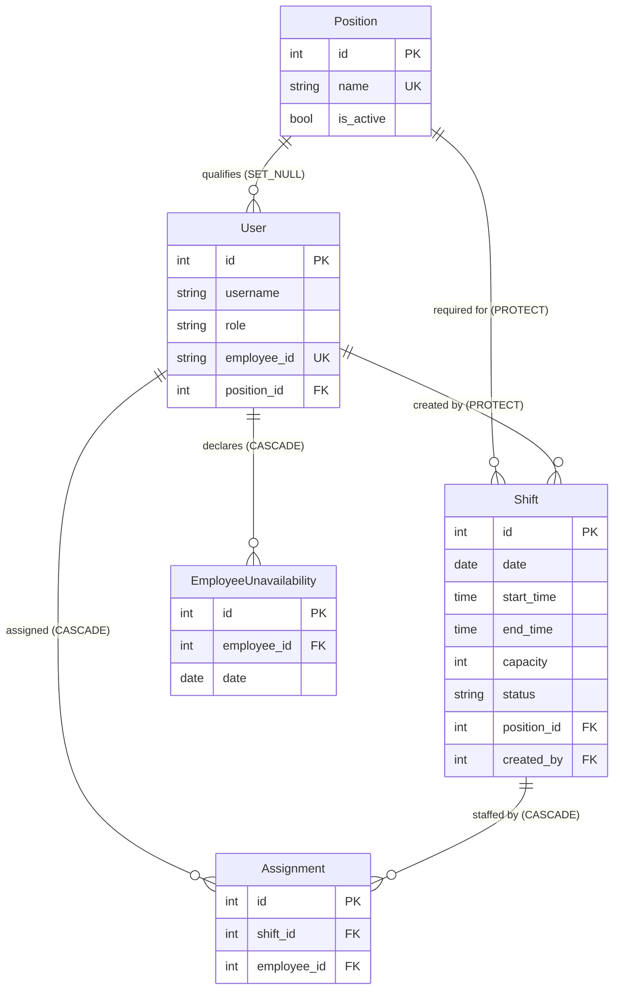

# PlanShift

A shift-scheduling web application for hourly-employment teams — coffee shops, restaurants, retail. Managers build a schedule on an interactive calendar, the server enforces the scheduling rules, and employees see only what has been published to them.

[](https://www.python.org/)
[](https://www.djangoproject.com/)
[](https://www.sqlite.org/)
[](https://react.dev/)
[](https://tailwindcss.com/)
[](https://vite.dev/)
[](LICENSE)

Building a rota by hand is mostly conflict-checking: does this person hold the right position, are they already booked, did they ask for the day off, is the shift now over capacity? PlanShift moves those checks into the application layer so an invalid schedule cannot be saved in the first place.


*Manager weekly view — overlapping shifts placed side by side in lanes, with each employee's scheduled hours in the sidebar.*

<details>
<summary><b>More screenshots</b></summary>

<br>


*Monthly view — published shifts in colour, unpublished drafts greyed out.*

<br>


*Employee calendar — only published shifts the employee is assigned to, with unavailable days marked in red.*

</details>

## Features

### Manager

- **Two calendar views** — a weekly hour grid that lays out overlapping shifts side by side, and a monthly overview.
- **Draft and publish workflow** — shifts are created as drafts, visible only to managers. Publishing pushes a date range to employee calendars in one action.
- **Validated assignment** — employees are assigned to shifts inline; the server rejects any combination that breaks a scheduling rule and explains why.
- **Team and position management** — create employees, define the positions they are qualified for, and generate account credentials. The generated password is displayed exactly once and stored only as a hash.
- **Workload sidebar** — lists active employees with their scheduled hours for the current period, and highlights a person's shifts on click.

### Employee

- **Personal calendar** — a monthly view containing only published shifts the employee is assigned to.
- **Unavailability** — mark or clear a future day as unavailable with a single click; the change is saved asynchronously and immediately blocks assignment on that day.

## Scheduling rules

Every assignment passes through four checks in `backend/apps/scheduling/services.py`, inside the same transaction that saves the shift:

| Rule | Behaviour |
|---|---|
| `_check_position_match` | An employee may only be assigned to a shift for the position they hold — a barista cannot fill a head-chef shift. |
| `_check_capacity` | The number of assignees may not exceed the shift's capacity. |
| `_check_availability` | An employee marked unavailable for that date cannot be assigned. |
| `_check_no_overlap` | An employee cannot hold two shifts whose time ranges overlap; back-to-back shifts are allowed. |

If any check fails, `ValidationError` propagates out of the `transaction.atomic()` block in `use_cases.py` and the whole write is rolled back, so a shift is never left half-assigned.

## Architecture

A React front end on a Django back end. Django owns authentication, the scheduling
rules and every write; React owns the whole rendered page. There is no REST layer and no
client-side router: each Django view renders one HTML shell that mounts a single React
entry point and hands it a JSON payload, so the app keeps Django's session auth, CSRF
protection and POST-redirect-flash-message flow while the UI is entirely component-based.

```
├── backend/
│   ├── config/                 # settings, root URLconf, WSGI/ASGI
│   └── apps/
│       ├── accounts/           # custom User model, roles, auth, role decorators
│       ├── frontend/
│       │   ├── shell.py        # render_app(): page shell + JSON bootstrap payload
│       │   └── templatetags/   #  — manifest → <script>/<link>
│       └── scheduling/
│           ├── models.py       # Position, Shift, Assignment, EmployeeUnavailability
│           ├── services.py     # scheduling rules + query helpers
│           ├── use_cases.py    # transactional save/publish orchestration
│           ├── tests.py        # rule and visibility tests
│           ├── management/     # seed_demo command
│           └── views/          # employee, manager_shifts, manager_resources
├── frontend/
│   ├── templates/app.html      # the one Django template: <div id="root"> + payload
│   ├── vite.config.js          # one build input per page
│   └── src/
│       ├── entries/            # login · manager-shifts · manager-employees · employee-shifts
│       ├── pages/              # page components (calendar, team table, modals)
│       ├── components/         # shell, modals, menus, toasts, calendar primitives
│       ├── app/                # dates, lane layout, position palette, CSRF/fetch
│       └── styles/             # Tailwind theme tokens + component layer
├── docker/entrypoint.sh        # migrate + seed, then start the server
├── Dockerfile                  # stage 1 builds the bundle, stage 2 runs Django
├── docker-compose.yml
└── manage.py                   # wrapper so commands run from the project root
```

Views stay thin: they parse the request and render. Business rules live in `services.py`, transaction boundaries in `use_cases.py`.

### Notable implementation details

- **State injection instead of a load-time API round trip.** `render_app()` serialises the user, navigation, flash messages, CSRF token, action URLs and the page's own data into one `<script type="application/json">` block. React reads it synchronously on boot, so the calendar paints without a fetch and no REST layer is needed.
- **Forms stay native.** Every write (create, edit, publish, delete, employee CRUD) is a real `<form method="post">` rendered by React, so Django's CSRF middleware, form validation, redirect and flash messages keep working unchanged — the messages arrive with the next payload and become toasts.
- **Greedy lane placement for overlapping shifts.** `src/app/shifts.js` sorts a day's shifts by start time and drops each into the first lane whose previous shift has ended, allocating a new lane only when none is free. Lane index and count become absolute CSS coordinates on the chip, and the day's column widens with its lane count.
- **Deterministic position colours.** Chip colours are derived from the position ID (`hue = (id * 47) % 360`) rather than stored in the database, so a new position is immediately distinguishable without a migration or a colour picker. The palette is emitted as inline custom properties that the `.shift-chip-position` rule consumes. The calendar legend lists only the positions present in the visible period.
- **One dismissal stack for overlays.** Modals and popovers register in a shared layer stack (`src/components/escape.js`), so Escape and backdrop clicks always resolve the top-most layer first — a position picker closes before the shift modal it lives in.
- **Async unavailability toggle.** Employee day toggles go through the Fetch API and return a `JsonResponse`; React updates the cell and the chip list from local state, and the server re-validates the date on every call.

### Styling

Tailwind CSS v4 with the design tokens declared once in `src/styles/tokens.css`:

```css
@theme {
  --color-primary: hsl(221 83% 53%);
  --color-muted-foreground: hsl(215 16% 47%);
  --radius-card: 0.5rem;
}
```

Because they live in `@theme`, the same token powers a utility in markup (`text-muted-foreground`)
and hand-written CSS (`var(--color-muted-foreground)`). Layout, spacing and typography are
Tailwind utilities in JSX; recurring or structural pieces — buttons, form controls, cards,
tables, menus, shift chips, the week/month grids — stay as component classes in
`src/styles/components/`, where CSS does what utilities cannot: sticky grid headers,
container queries that shed chip detail as a cell narrows, and scrollbar styling.

## Data model



Deletion behaviour is chosen per relationship: removing a position leaves employee accounts intact (`SET_NULL`) but is blocked while shifts still require it (`PROTECT`). Two unique constraints keep the schedule coherent at the database level — one employee per shift (`unique_employee_per_shift`) and one unavailability record per employee per day (`unique_employee_unavailability_day`).

## Security

- **Object-level authorisation on shifts.** Manager endpoints resolve a shift with `get_object_or_404(Shift.objects, pk=shift_id, created_by=request.user)`, so guessing another manager's shift ID returns 404 rather than granting access. Positions and employees are intentionally shared across managers as a single organisational directory.
- **Role-gated views.** `manager_required` / `employee_required` decorators guard every view; unauthenticated access redirects to the login page.
- **Credential handling.** Generated passwords are held in the session only long enough to be shown once, and persisted solely as a PBKDF2 hash.
- **Standard Django protections** are left in place — CSRF middleware, template auto-escaping, ORM-parameterised queries, clickjacking headers. Fetch calls read the CSRF token at runtime and send it as `X-CSRFToken`.

`SECRET_KEY`, `DEBUG` and `ALLOWED_HOSTS` are read from the environment; the built-in defaults are development-only.

## Getting started

### With Docker (recommended)

```bash
git clone https://github.com/DT-sudo/planshift.git
cd planshift
docker compose up
```

That is the whole setup — the image builds the front-end bundle in its own stage, and the
container applies migrations and seeds a month of demo data on first boot, so
<http://127.0.0.1:8000/> opens on a populated schedule.

The image runs Django's development server with `DEBUG` enabled so the one-click demo
logins work — it is a demo environment, not a production image.

### With a local environment

Requires **Python 3.12+** and **Node 20+** (the front end is a Vite build).

```bash
git clone https://github.com/DT-sudo/planshift.git
cd planshift

python3 -m venv .venv
source .venv/bin/activate          # Windows: .venv\Scripts\activate
pip install -r requirements.txt

cd frontend && npm install && npm run build && cd ..

python manage.py migrate
python manage.py seed_demo         # optional: demo positions, staff and shifts
python manage.py runserver
```

The app is served at <http://127.0.0.1:8000/>.

Django serves the bundle from `frontend/dist` and resolves hashed filenames through Vite's
manifest, so **the front end must be built once before the first run** and rebuilt after any
change under `frontend/src`.

### Working on the front end

For hot module reload, run Vite alongside Django and point Django at the dev server:

```bash
cd frontend && npm run dev          # terminal 1 — http://localhost:5173
VITE_DEV_SERVER_URL=http://localhost:5173 python manage.py runserver   # terminal 2
```

Keep browsing <http://127.0.0.1:8000/>: Django then loads the modules from Vite instead of
`dist`, and edits appear without a rebuild or a page reload. Unset the variable to go back
to the built bundle.

### Demo accounts

While `DEBUG` is on, two demo accounts are available so the app can be explored without
any setup:

| Role | Username | Password |
|---|---|---|
| Manager | `manager_demo@example.com` | `demo12345!` |
| Employee | `employee_demo@example.com` | `demo12345!` |

For your own manager account, use `python manage.py createsuperuser`.

### Configuration

All settings fall back to development defaults; override through the environment as needed.

| Variable | Default |
|---|---|
| `DEBUG` | `1` |
| `SECRET_KEY` | development placeholder |
| `ALLOWED_HOSTS` | `localhost,127.0.0.1` |
| `TIME_ZONE` | `UTC` |
| `DB_ENGINE` | `django.db.backends.sqlite3` |
| `DB_NAME`, `DB_USER`, `DB_PASSWORD`, `DB_HOST`, `DB_PORT` | SQLite defaults |
| `SEED_DEMO_DATA` | `1` (Docker entrypoint only) |
| `VITE_DEV_SERVER_URL` | empty (serve the built bundle) |


## Tests

```bash
python manage.py test apps
```

The suite covers the four scheduling rules — including the boundary case that back-to-back shifts are permitted while overlapping ones are not — and the draft/published visibility split between the manager and employee views.

## License

MIT — see [LICENSE](LICENSE).
