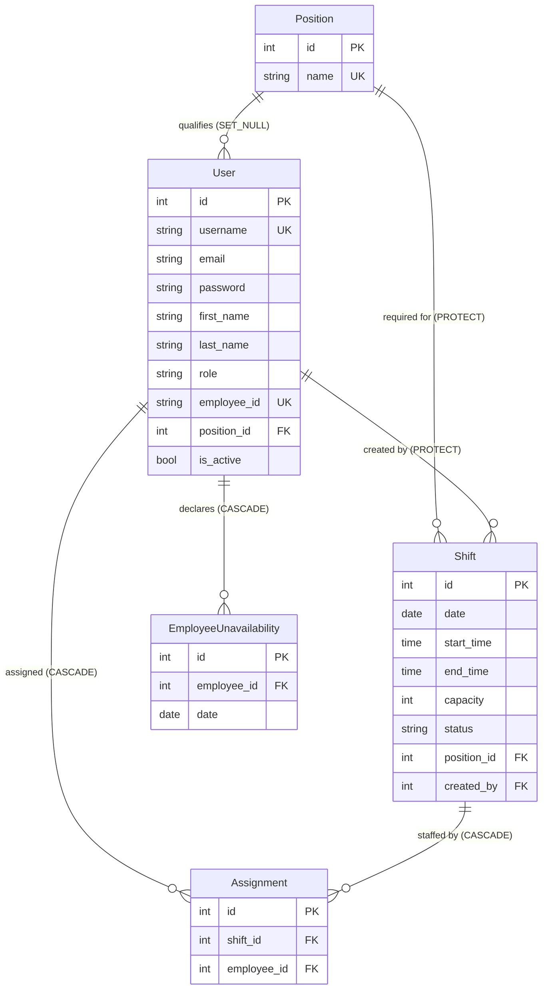

*This project has been created as part of the 42 curriculum by dtereshc.*

<!-- TEAM: add the remaining logins above as `dtereshc, login2, login3, login4`, then
     fill in the Team Information, Features List and Individual Contributions
     tables below. Every team member must appear in all three. -->

# PlanShift

[](https://www.python.org/)
[](https://www.djangoproject.com/)
[](https://www.sqlite.org/)
[](https://react.dev/)
[](https://tailwindcss.com/)
[](https://vite.dev/)
[](https://nginx.org/)
[](LICENSE)

## Table of contents

- [Description](#description)
- [Instructions](#instructions)
- [Team Information](#team-information)
- [Project Management](#project-management)
- [Technical Stack](#technical-stack)
- [Database Schema](#database-schema)
- [Features List](#features-list)
- [Architecture](#architecture)
- [Security](#security)
- [Modules](#modules)
- [Individual Contributions](#individual-contributions)
- [Tests](#tests)
- [Resources](#resources)
- [Known limitations](#known-limitations)
- [License](#license)

---

## Description

**PlanShift** is a shift-scheduling web application for hourly-employment teams — coffee shops,
restaurants, retail. Managers build a schedule on an interactive calendar, the server enforces the
scheduling rules, and employees see only what has been published to them.

**The goal.** Building a rota by hand is mostly conflict-checking: does this person hold the right
position, are they already booked, did they ask for the day off, is the shift now over capacity?
Every one of those checks is easy to get wrong at 6 a.m. on a Monday. PlanShift moves them into the
application layer, inside the transaction that saves the shift, so an invalid schedule cannot be
written to the database in the first place.

**Overview.** Two roles share one calendar. A manager drafts shifts privately, assigns staff to
them, and publishes a date range in one action; employees then see their own shifts appear, and can
mark days they are unavailable, which immediately blocks any assignment on that day.

### Key features

- Monthly calendar overview with the team list beside it.
- Draft/publish workflow — drafts are manager-only until published.
- Four scheduling rules enforced server-side inside one transaction.
- Team and position management, with one-time generated credentials.
- Employee self-service unavailability, pushed live to open manager calendars over WebSockets.
- Shift search with a text query, filters, sortable columns and pagination.
- Analytics dashboard with KPIs, charts, top lists and CSV/PDF export, refreshed live when shifts change.
- Notification bell: every toast is kept in a per-account history with an unread count.
- Email + password sign-up and login, with passwords stored only as salted PBKDF2 hashes.
- End-to-end HTTPS, with plain HTTP redirected to TLS.
- Accessible Privacy Policy and Terms of Service.

---

## Instructions

### Prerequisites

| Requirement | Version | Needed for |
|---|---|---|
| Docker Engine | 24+ | The one-command run (recommended) |
| Docker Compose | v2 | `docker compose` subcommand |
| Python | 3.12+ | Local (non-Docker) run only |
| Node.js | 20+ | Local (non-Docker) run only — builds the Vite bundle |

Nothing else is required: the image builds the front end in its own stage, applies migrations and
generates its TLS certificate on first boot.

### Step-by-step: running with Docker (recommended)

```bash
# 1. Clone the repository
git clone https://github.com/DT-sudo/planshift.git
cd planshift

# 2. Create your environment file from the template
cp .env.example .env

# 3. Generate a real secret key and put it in .env
python3 -c "import secrets; print('SECRET_KEY=' + secrets.token_urlsafe(64))"
#    ...then edit .env and replace the SECRET_KEY line with the output.

# 4. Build and start the whole stack — this is the single command
docker compose up --build
```

Then open **<https://localhost:8443/>**.

> **The browser will warn about the certificate.** The proxy generates a *self-signed* certificate
> on first boot, so no certificate authority vouches for it. Click **Advanced → Proceed to
> localhost**. The connection is genuinely encrypted (TLS 1.3); only the issuer is untrusted.
> Plain HTTP on <http://localhost:8080/> answers with a `301` to the HTTPS address and serves
> nothing.

To stop the stack, press `Ctrl-C`, then `docker compose down`. Add `-v` to also drop the database
and TLS volumes and start completely fresh.

### Configuration (`.env`)

`.env` is git-ignored and never copied into the Docker image (see `.dockerignore`). `.env.example`
is the committed template and documents every variable. Real environment variables always override
the file.

| Variable | Default | Purpose |
|---|---|---|
| `SECRET_KEY` | dev placeholder | Django cryptographic signing key — **change this** |
| `DEBUG` | `1` | Verbose errors and auto-reload; must be `0` in production |
| `ALLOWED_HOSTS` | `localhost,127.0.0.1,web` | Hostnames Django answers for |
| `CSRF_TRUSTED_ORIGINS` | `https://localhost:8443,...` | Origins allowed to POST |
| `TIME_ZONE` | `UTC` | Timezone used for shift times |
| `DB_ENGINE` / `DB_NAME` / `DB_USER` / `DB_PASSWORD` / `DB_HOST` / `DB_PORT` | SQLite | Database connection |
| `SECURE_COOKIES` | `1` | `Secure` flag on session and CSRF cookies |
| `HTTPS_PORT` / `HTTP_PORT` | `8443` / `8080` | Ports the nginx proxy publishes |
| `SECURE_HSTS_SECONDS` | `31536000` | HSTS lifetime (applied only when `DEBUG=0`) |
| `SEED_DEMO_DATA` | `1` | Seed demo positions, staff and shifts on boot |
| `ENABLE_DEMO_LOGIN` | value of `DEBUG` | Show the one-click demo login buttons |

### Step-by-step: running locally without Docker

```bash
git clone https://github.com/DT-sudo/planshift.git
cd planshift
cp .env.example .env

python3 -m venv .venv
source .venv/bin/activate          # Windows: .venv\Scripts\activate
pip install -r requirements.txt

# The front end must be built once before the first run
cd frontend && npm install && npm run build && cd ..

python manage.py migrate
python manage.py seed_demo         # optional: demo positions, staff and shifts
python manage.py runserver
```

This serves plain HTTP on <http://127.0.0.1:8000/> for development only — it has no TLS, so set
`SECURE_COOKIES=0` in `.env` or the browser will refuse to store the session cookie. **Use the
Docker stack for anything that needs to match the deployed setup**, including evaluation.

Rebuild the bundle (`npm run build`) after any change under `frontend/src`.

### Accounts

Anyone can open a **manager** account from the sign-up page. Employees do not self-register: their
manager creates the account, and the generated password is displayed exactly once.

`seed_demo` (run on every Docker boot while `SEED_DEMO_DATA=1`) creates two accounts you can sign in with:

| Role | Email | Password |
|---|---|---|
| Manager | `manager_demo@example.com` | `demo12345!` |
| Employee | `employee_demo@example.com` | `demo12345!` |

While `ENABLE_DEMO_LOGIN` is on, the login page also shows **Demo: Manager login** and
**Demo: Employee login** buttons that sign in as these accounts in one click.

---

## Team Information

<!-- TEAM: replace the placeholder rows. Every member needs a role and a
     responsibility description. One person may hold several roles. -->

| Member (42 login) | Role(s) | Responsibilities |
|---|---|---|
| `dtereshc` | Tech Lead / Architect, Developer | Defined the Django + React architecture and the state-injection pattern, chose the stack, owns the scheduling rule engine and code review of critical changes. |
| `<login2>` | Product Owner, Developer | Product vision and backlog, feature prioritisation, validates completed work, communicates with evaluators. |
| `<login3>` | Project Manager / Scrum Master, Developer | Runs planning and stand-ups, tracks deadlines and blockers, keeps team communication going. |
| `<login4>` | Developer | Implements assigned features and modules, participates in code review, tests and documents their work. |

---

## Project Management

<!-- TEAM: adjust to what the team actually did — this section is checked at
     evaluation and everyone must be able to describe it consistently. -->

**How the work was organised.** The project was split along feature boundaries that map onto the
directory layout, so two people rarely touched the same file: the scheduling rule engine
(`services.py`), the manager calendar, the team-and-positions area, and the
auth/legal/infrastructure layer. Each feature was taken end to end by its owner — model, view,
React page and tests — which kept the interfaces between areas explicit.

**Meetings.** A short sync at the start of each working session to agree who takes what, and a
longer review at the end of each week to demo what landed and re-prioritise.

**Task tracking.** GitHub Issues, one issue per feature, grouped on a project board with
`todo / in progress / review / done` columns. Pull requests reference their issue so the board
reflects the branch state.

**Code review.** Every pull request needs one approval from another member before merging to
`main`. Changes to the rule engine or to anything security-related get reviewed by the Tech Lead.

**Communication.** A Discord server with one channel per work area plus a general channel for
blockers.

---

## Technical Stack

### Frontend

| Technology | Why |
|---|---|
| **React 19** | The calendar is a genuinely stateful UI — modals stack, cells toggle asynchronously. Component state is the right model for that, and React's ecosystem is the one the team already knew. |
| **Vite 8** | Near-instant dev server with HMR, and a manifest-based production build. One build input per page keeps each page's JavaScript to what it actually needs. |
| **Tailwind CSS 4** | Required styling solution. v4 declares design tokens in `@theme`, so a single token drives both a utility class in JSX (`text-muted-foreground`) and hand-written CSS (`var(--color-muted-foreground)`) — no duplicated palette. |

Layout, spacing and typography are Tailwind utilities in JSX. Recurring or structural pieces —
buttons, form controls, cards, tables, menus, shift chips, the month grid — stay as component
classes in `src/styles/components/`, where CSS does what utilities cannot: sticky grid headers,
container queries that shed chip detail as a cell narrows, and scrollbar styling.

### Backend

| Technology | Why |
|---|---|
| **Django 6** | Batteries included, and every battery here is one the subject requires: session auth, CSRF middleware, password hashing and validators, an ORM with migrations, and form validation. Building the same guarantees on a microframework would have been the actual project. |
| **nginx 1.27** | TLS terminator. Keeping TLS out of the application means Django never handles certificates, and the proxy is the only service that publishes a port. |
| **Django Channels + Daphne** | WebSockets for live updates. Channels adds consumers and group broadcasting on top of Django. Daphne is its ASGI server and also sits behind `runserver`, so one process serves both HTTP and WebSockets. |
| **Redis 7** | The channel layer that carries broadcasts between server processes. Pure pub/sub with persistence off. Without `REDIS_URL`, local runs and tests use an in-process layer. |

The dependency list is deliberately short: Django, plus Channels, Daphne and channels-redis for
WebSockets. Everything else — the `.env` loader, the email auth backend, the Vite manifest template
tag — is ~30 lines of project code, which is easier to explain at evaluation than an extra
dependency.

### Database

**SQLite**, chosen because the workload is a handful of managers writing a schedule: single-digit
writes per minute, no sharding, no replication. It needs no separate service, so `docker compose up`
brings up the whole stack with one image, and the database file lives on a named volume that
survives restarts.

Because access goes exclusively through the Django ORM, moving to PostgreSQL is a change to
`DB_ENGINE` and five environment variables — no query rewriting. `.env.example` documents that
configuration.

### Significant technical choices

- **No REST layer, no client-side router.** Each Django view renders one HTML shell that mounts a
  single React entry and hands it a JSON payload (`render_app()` in `apps/shell.py`). The
  page paints without a load-time API round trip, and the app keeps Django's session auth, CSRF
  protection and POST-redirect-flash-message flow while the UI stays fully component-based.
- **Forms stay native.** Every write is a real `<form method="post">` rendered by React, so Django's
  form validation and CSRF middleware work unchanged. Search and analytics filters are plain GET
  forms. The only `fetch` calls are the unavailability toggle, which must not reload the calendar,
  and the analytics refresh.
- **Live updates over one WebSocket per page.** Writes stay plain HTTP. Once a change commits, the
  view broadcasts a small event (`notify_managers()` in `apps/realtime/events.py`, run from
  `transaction.on_commit`), and open pages patch their state from it. When an employee changes
  their availability, it reaches every open manager calendar without a reload. Every shift write
  sends `shifts.changed`, and open analytics dashboards re-fetch their numbers.
- **Rules live in one place.** All four scheduling rules and the transactional `save_shift()` are
  functions in `services.py`. Views parse requests and render; they never contain business logic.

---

## Database Schema



### Tables and key fields

| Table | Key fields | Notes |
|---|---|---|
| `User` (`accounts.User`) | `username` (unique, mirrors `email`), `email`, `password` (PBKDF2 hash), `role` (`manager`/`employee`), `employee_id` (unique, auto-generated `EMP-######`), `position_id` (FK, nullable) | Extends `AbstractUser`, so Django's auth and password hashing work unchanged |
| `Position` | `name` (unique, ≤25 chars) | The organisational directory of roles a shift can require |
| `Shift` | `date`, `start_time`, `end_time`, `capacity` (positive int), `status` (`draft`/`published`), `position_id`, `created_by` | `Meta.ordering = ["date", "start_time"]` |
| `Assignment` | `shift_id`, `employee_id` | Join table; unique together as `unique_employee_per_shift` |
| `EmployeeUnavailability` | `employee_id`, `date` (indexed) | Unique together as `unique_employee_unavailability_day` |

### Relationships and integrity

Deletion behaviour is chosen per relationship rather than left at the default:

- Removing a **position** leaves employee accounts intact (`SET_NULL`) but is **blocked** while
  shifts still require it (`PROTECT`) — a shift with no position would be unschedulable.
- Deleting an **employee** cascades to their assignments and unavailability, so no orphan rows
  remain.
- A **shift** cannot be created by a user who is later deleted (`PROTECT` on `created_by`).

Two unique constraints keep the schedule coherent at the database level, not just in application
code: one employee per shift, and one unavailability record per employee per day.

---

## Features List

<!-- TEAM: reassign the Owner column to reflect who actually wrote each feature. -->

### Authentication and accounts

| Feature | Description | Owner |
|---|---|---|
| Sign up | Public registration of a manager account with full name, email and password. Server validates uniqueness, format and password strength; the account is created and logged in atomically. | `dtereshc` |
| Email + password login | Authentication by email address: every account's `username` mirrors its lowercased email, so the login form lowercases the input and Django's default backend does the rest. Case-insensitive, and the hasher runs even for unknown addresses so response time does not reveal whether an account exists. | `dtereshc` |
| Logout | POST-based logout from the user menu. | `dtereshc` |
| Role-based routing | After login, managers land on the schedule and employees on their own calendar; every view is gated by a role decorator. | `<login2>` |

### Manager

| Feature | Description | Owner |
|---|---|---|
| Monthly calendar | Month overview: published shifts coloured by position, with the colour key in the pinned footer; drafts dashed and grey. | `<login2>` |
| Create / edit / delete shifts | Modal form for date, times, position and capacity, with client and server validation. | `<login3>` |
| Draft and publish workflow | Shifts start as drafts visible only to managers; publishing pushes a date range to employee calendars in one action. | `<login3>` |
| Employee assignment | Staff are assigned inline; the server rejects any combination that breaks a rule and explains why. | `dtereshc` |
| Team management | Create, edit and delete employees; reset a password. Generated passwords are shown exactly once and stored only as a hash. | `<login4>` |
| Position management | Create and delete the positions employees can hold, with deletion blocked while shifts require them. | `<login4>` |
| Team sidebar | Lists active employees with their position and their unavailable days in the visible month. | `<login2>` |
| Live availability | When an employee marks or clears a day, open manager calendars update within a second. The sidebar lists that employee's unavailable days, the shift form greys them out for that date, and a toast says who changed what. | `dtereshc` |
| Shift search | A table of all the manager's shifts: free-text search over position and worker names, position/worker/status/date filters, sortable columns and 25-per-page pagination. Each date links to that month in the calendar. | `<login2>` |
| Analytics dashboard | KPIs (shifts, workers, hours, open shifts), shifts over time, by position and by status, hours per worker, and top workers/positions, over a date range (last 30 days by default) and the same filters as search. A worker filter isolates that worker's hours. Export as CSV (raw rows) or PDF (the browser's print dialog). Numbers refresh live whenever a shift is written. | `<login3>` |

### Employee

| Feature | Description | Owner |
|---|---|---|
| Personal calendar | Monthly view containing only published shifts the employee is assigned to. | `<login3>` |
| Unavailability toggle | Mark or clear a future day as unavailable in one click; saved asynchronously and immediately blocks assignment on that day. | `<login3>` |

### Cross-cutting

| Feature | Description | Owner |
|---|---|---|
| Scheduling rule engine | Position match, capacity, availability and overlap checks, all inside the transaction that saves the shift. | `dtereshc` |
| Two-sided form validation | The browser enforces `required`, `type="email"` and `minLength` before submitting; Django validates everything again and re-renders field errors inline. | `dtereshc` |
| HTTPS everywhere | nginx terminates TLS with a self-signed certificate generated on first boot; HTTP is redirected; cookies are `Secure`. | `dtereshc` |
| Privacy Policy & Terms | Public, project-specific legal pages linked from the footer of every page. | `<login4>` |
| Notifications | Django flash messages and client events (such as marking a day unavailable) show as toasts and go into a per-account history behind the header bell, with an unread badge. Repeats collapse into one entry with a counter. | `<login4>` |

### Scheduling rules in detail

Every assignment passes four checks in `backend/apps/scheduling/services.py`:

| Rule | Behaviour |
|---|---|
| `_check_position_match` | An employee may only be assigned to a shift for the position they hold — a barista cannot fill a head-chef shift. |
| `_check_capacity` | The number of assignees may not exceed the shift's capacity. |
| `_check_availability` | An employee marked unavailable for that date cannot be assigned. |
| `_check_no_overlap` | An employee cannot hold two shifts whose time ranges overlap; back-to-back shifts are allowed. |

If any check fails, `ValidationError` propagates out of the `transaction.atomic()` block in
`save_shift()` and the whole write is rolled back, so a shift is never left half-assigned.

---

## Architecture

```
├── backend/
│   ├── config/
│   │   ├── settings.py         # env-driven config, TLS/cookie hardening
│   │   ├── env.py              # minimal .env loader (no dependency)
│   │   ├── asgi.py             # HTTP + WebSocket routing (Channels)
│   │   └── urls.py             # root URLconf
│   └── apps/
│       ├── accounts/           # custom User, roles, signup/login
│       │   ├── forms.py        # SignUpForm, EmailAuthenticationForm, EmployeeForm
│       │   ├── views.py        # role decorators, auth, demo logins, employee directory
│       │   └── tests.py        # auth, validation and legal-page tests
│       ├── shell.py            # render_app(): page shell + JSON payload; flash redirects
│       ├── legal/
│       │   ├── documents.py    # Privacy Policy / Terms content
│       │   └── views.py
│       ├── realtime/
│       │   ├── consumers.py    # WebSocket consumer + /ws/schedule/ route
│       │   └── events.py       # notify_managers(): broadcast once the write commits
│       └── scheduling/
│           ├── models.py       # Position, Shift, Assignment, EmployeeUnavailability
│           ├── services.py     # the four scheduling rules, save/publish, search/analytics queries
│           ├── tests.py        # rule, visibility, search and analytics tests
│           └── views.py        # manager calendar + writes, positions, search, analytics, employee calendar
├── frontend/
│   ├── templates/app.html      # the one Django template: <div id="root"> + payload
│   ├── vite.config.js          # one build input: src/main.jsx
│   └── src/
│       ├── main.jsx            # mounts the page named in the payload
│       ├── pages/              # auth, legal, calendar, search, analytics, team table, modals
│       ├── components/         # shell + footer, fields, modals, menus, notifications, hooks
│       ├── app/                # dates, shifts (availability, per-employee stats), http, live socket
│       └── styles/             # Tailwind theme tokens + component layer
├── docker/
│   ├── entrypoint.sh           # migrate + seed, then start the server
│   └── nginx/                  # TLS terminator: config template + cert generation
├── Dockerfile                  # stage 1 builds the bundle, stage 2 runs Django
├── docker-compose.yml          # web + redis + proxy, one command
├── .env.example                # committed template; .env itself is ignored
└── manage.py                   # Django CLI, run from the project root
```

### Notable implementation details

- **State injection instead of a load-time API round trip.** `render_app()` serialises the user,
  navigation, flash messages, CSRF token, action URLs and the page's own data into one
  `<script type="application/json">` block, read synchronously on boot.
- **One dismissal stack for overlays.** Modals and the user menu register in a shared layer stack
  (`src/components/hooks.js`), so Escape and backdrop clicks always resolve the top-most layer
  first.

---

## Security

- **HTTPS end to end.** nginx terminates TLS 1.2/1.3 and is the only service that publishes a port;
  Django listens solely on the internal compose network. Plain HTTP returns `301` to HTTPS.
  `SECURE_PROXY_SSL_HEADER` lets Django trust the proxy's `X-Forwarded-Proto`.
- **Password storage.** Salted PBKDF2-SHA256 only. Django's length, common-password, numeric and
  user-similarity validators run on every registration; `SignUpForm._post_clean` populates the
  instance first so the similarity check can actually see the name and email.
- **Cookies.** Session and CSRF cookies are `Secure` and `SameSite=Lax`; the session cookie is
  additionally `HttpOnly`.
- **Headers.** `X-Frame-Options: DENY`, `X-Content-Type-Options: nosniff`,
  `Referrer-Policy: same-origin`, and HSTS when `DEBUG=0`.
- **Object-level authorisation.** Manager endpoints resolve a shift with
  `get_object_or_404(Shift.objects, pk=shift_id, created_by=request.user)`, so guessing another
  manager's shift ID returns 404 rather than granting access.
- **Role-gated views.** `manager_required` / `employee_required` guard every view; unauthenticated
  access redirects to login.
- **WebSocket access.** Sockets authenticate with the same session cookie. Anonymous sockets and
  sockets opened from another site (Origin not in `ALLOWED_HOSTS`) are refused, and so are
  employees: only managers' pages listen for schedule changes. Under Docker, the socket goes through the same TLS
  proxy (`wss://`).
- **Secrets.** `SECRET_KEY`, database credentials and host configuration come from `.env`, which is
  ignored by both Git and Docker. The built-in defaults are development-only.
- **Demo logins are opt-in.** The one-click demo buttons bypass password entry, so they are gated
  behind `ENABLE_DEMO_LOGIN` and default to off whenever `DEBUG=0`.

---

## Modules

<!-- TEAM: this section is REQUIRED and is currently a template. The mandatory
     part is complete; module selection from Chapter IV is still open. Fill in
     the table as modules land, and keep the point total visible — the subject
     requires a minimum of 14 points. -->

**Status: module selection in progress. The mandatory part is complete.**

Required minimum: **14 points** (Major = 2 pts, Minor = 1 pt).

| Module | Chapter | Major/Minor | Points | Justification | How it was implemented | Owner |
|---|---|---|---|---|---|---|
| GDPR compliance features | IV.8 Data and Analytics | Minor | 1 | Users must be able to see, export and erase their own data. | Self-service `apps/privacy` module: "Privacy & my data" (account menu) lets any signed-in user download a readable JSON export of everything held about them and delete their own account (email + password confirmation, with a `ProtectedError` guard for managers who still have shifts on the schedule). Both actions send a confirmation email (console backend by default, real SMTP via `.env`). | _TBD_ |
| Complete 2FA (Two-Factor Authentication) system | IV.3 User Management | Minor | 1 | A stolen or guessed password alone must not open an account, and managers see everyone's schedule and personal details. | `apps/twofactor`: users turn it on in Account settings by scanning a QR code with any authenticator app (TOTP, RFC 6238, implemented with the standard library) and confirming a code; they get 10 one-time recovery codes, stored hashed. Sign-in then asks for a code after the password (`/login/verify/`, demo logins included), refuses replayed codes and locks for 5 minutes after 5 wrong ones. Turning it off or replacing the codes takes the password and a code; a manager/admin can reset it for an account they manage. Every change sends an email and a notification. | _TBD_ |
| Support for multiple languages (at least 3) | IV.2 Accessibility and Internationalization | Minor | 1 | Hourly teams are multilingual: everyone should read their schedule, emails and notifications in their own language. | English, Czech and Arabic. Server text goes through Django gettext (`backend/locale/`), React text through JSON catalogs and a small `t()` with CLDR plural forms (`frontend/src/i18n/`). A switcher in the footer of every page and in Account settings changes the language in place, without a reload; the choice is saved on the account, so emails and live notifications reach each recipient in their own language (notifications are stored as a kind + parameters and written when read). The legal pages are translated as whole documents. `npm run i18n:check` keeps the three catalogs complete. | _TBD_ |
| Right-to-left (RTL) language support | IV.2 Accessibility and Internationalization | Minor | 1 | Arabic reads right to left, so the whole layout has to mirror, not just the text. | Django renders `<html dir="rtl">` for Arabic; the CSS uses logical properties (the week grid included), the charts mirror their geometry, directional icons flip, and values that always read left to right (emails, times, codes) keep `dir="ltr"`. Switching between LTR and RTL happens in place. | _TBD_ |
| _TBD_ | | | | | | |

**Running total: 4+ / 14 points** (only the GDPR, 2FA, i18n and RTL modules above are tracked so far - fill in the rest as other modules land).

---

## Individual Contributions

<!-- TEAM: each member writes their own entry. Be specific and honest — the
     subject asks for real challenges, and evaluators ask about them. -->

### `dtereshc` — Tech Lead / Architect, Developer

**What I contributed.** The overall architecture: the decision to render one React entry per Django
view with an injected JSON payload rather than building a REST API, and the layering that keeps
views thin and rules and transaction boundaries in `services.py`. I wrote the
scheduling rule engine and its tests, the authentication layer (sign-up, the email backend, the
password-validation wiring), the form validation, and the TLS/deployment setup.

**Challenges.**

- *Keeping validation honest in two places.* An early version duplicated every rule in JavaScript,
  and the two copies drifted. The browser now only enforces what HTML can express (`required`,
  `type="email"`, `minLength`), the server is the single authority, and tests post invalid data
  directly to prove the backend rejects what the browser would have caught.
- *Django's similarity validator seeing nothing.* On a `ModelForm` whose only model field is
  `email`, `UserAttributeSimilarityValidator` had almost nothing to compare against, so passwords
  built from the user's own name passed. Populating `username`, `first_name` and `last_name` on the
  instance inside `_post_clean` before running the validators fixed it.

### `<login2>` — Product Owner, Developer

<!-- TEAM: what you built, and the challenges you hit. -->

### `<login3>` — Project Manager / Scrum Master, Developer

<!-- TEAM: what you built, and the challenges you hit. -->

### `<login4>` — Developer

<!-- TEAM: what you built, and the challenges you hit. -->

---

## Tests

```bash
# With the stack running
docker compose exec web python manage.py test apps

# Or locally, inside the virtualenv
python manage.py test apps
```

47 tests covering:

- **Scheduling rules** — all four checks, including the boundary case that back-to-back shifts are
  permitted while overlapping ones are not, and that duplicate IDs are deduplicated before the
  capacity check.
- **Visibility** — the draft/published split between the manager and employee views.
- **Search and analytics** — text query over positions and worker names, combined filters,
  sorting, pagination, scoping to the manager's own shifts, per-worker KPI isolation, and the CSV
  export.
- **Sign-up** — role assignment, email normalisation and uniqueness, password hashing, rejection of
  weak and mismatched passwords.
- **Login** — email authentication, case-insensitivity, wrong password, unknown address, and
  inactive accounts.
- **Server-side validation** — invalid email, missing position and duplicate email posted directly
  to the endpoint, bypassing the browser.
- **Legal pages** — public reachability, non-placeholder content, and footer links on every page.
- **Live updates** — the WebSocket consumer (anonymous refused, managers receive events, employees
  don't), a broadcast on every successful availability toggle and none on a rejected one, a
  broadcast on shift writes, and the availability data in the manager page.

---

## Resources

### Documentation

- [Django documentation](https://docs.djangoproject.com/en/stable/) — models, forms, auth, and the
  [security topic guide](https://docs.djangoproject.com/en/stable/topics/security/)
- [Django authentication](https://docs.djangoproject.com/en/stable/topics/auth/customizing/) —
  custom user models and authentication backends
- [React documentation](https://react.dev/learn) — hooks and component patterns
- [Vite guide](https://vite.dev/guide/) — multi-entry builds and the manifest
- [Tailwind CSS v4](https://tailwindcss.com/docs) — `@theme` tokens and the component layer
- [nginx: configuring HTTPS servers](https://nginx.org/en/docs/http/configuring_https_servers.html)
- [MDN Web Docs](https://developer.mozilla.org/) — CSS grid, container queries, the Fetch API
- [OWASP Cheat Sheet Series](https://cheatsheetseries.owasp.org/) — authentication, password
  storage and transport-security guidance
- [GDPR text (gdpr-info.eu)](https://gdpr-info.eu/) — reference for the Privacy Policy

### Articles and references

- [Django's `SECURE_PROXY_SSL_HEADER`](https://docs.djangoproject.com/en/stable/ref/settings/#secure-proxy-ssl-header)
  — the correct way to run behind a TLS-terminating proxy
- [The Twelve-Factor App: Config](https://12factor.net/config) — the reasoning behind
  environment-based configuration and `.env`
- [WAI-ARIA Authoring Practices](https://www.w3.org/WAI/ARIA/apg/) — dialog and live-region patterns
  used by the modals and toasts

---

## Known limitations

- The TLS certificate is self-signed, so browsers show a warning. A real deployment would use a
  certificate from a public CA (e.g. Let's Encrypt).
- The Docker image runs Django's development server (`runserver`, served by Daphne). It is a
  demo/evaluation environment; a production deployment would run Daphne or Uvicorn workers behind
  the same proxy.
- Live updates cover employee availability and the analytics numbers. Shift changes by other
  managers still reach calendars and search on the next reload. The socket reconnects silently;
  events sent while a page is offline are not replayed, so the calendar catches up on its next
  reload, while the analytics page re-fetches as soon as it reconnects.
- Notification history is kept in the browser (`localStorage`, per account), so it does not follow
  a user to another device, and it only records what happened on pages that user had open.
- There is no password-reset-by-email flow. A manager resets an employee's password and hands over
  the new one; a manager who loses their own password needs `python manage.py changepassword <email>`.
- Positions and employees form a single shared organisational directory rather than being scoped
  per manager. Shifts are scoped per manager.
- SQLite serialises writes. This is ample for the intended scale but would need PostgreSQL for a
  large multi-tenant deployment — a configuration change, not a code change.

---

## License

MIT — see [LICENSE](LICENSE).
